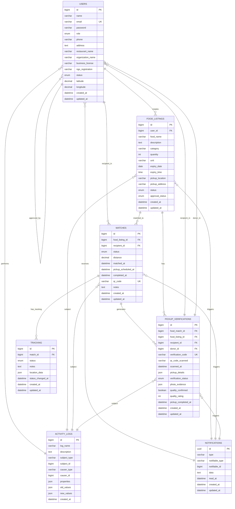

# MyFoodshare - Actual Database ERD

Based on analysis of the real Laravel application, this is the accurate Entity Relationship Diagram that matches the actual implementation.

## 🔄 **CRITICAL CORRECTIONS**
- **No separate `recipients` table** - All recipient data is embedded in `users` table
- **No separate `donors` table** - All donor data is embedded in `users` table
- **Role-based approach** - Users have roles ('donor', 'recipient', 'admin')
- **Real foreign key relationships** - All relationships match actual database constraints

---

## 📊 **Entity Relationship Diagram**



---

## 🔍 **Key Findings & Corrections**

### **1. User Model - Role-Based Architecture**
- **Single `users` table** handles all roles (donor, recipient, admin)
- **Recipient fields embedded**: `organization_name`, `contact_person`, `ngo_registration`
- **Donor fields embedded**: `restaurant_name`, `business_license`, `cuisine_type`
- **No separate `recipients` or `donors` tables** in actual implementation

### **2. Food Match Relationships**
- **FoodMatch → Restaurant**: References through `foodListing.user_id`
- **FoodMatch → Recipient**: Direct reference to `users.id` (role='recipient')
- **No `restaurant_id` field** in matches table

### **3. Pickup Verification Structure**
- **Multiple foreign keys**: Links to match, listing, recipient, and donor
- **Donor references**: Through `foodListing.user_id` or direct `donor_id`
- **Verification workflow**: QR scanning → completion → quality assessment

### **4. Activity & Notification Systems**
- **Comprehensive audit trail**: All entity activities logged
- **Real-time notifications**: Laravel's built-in notification system
- **Polymorphic relationships**: Activity logs can track any entity type

---

## 🗃️ **Actual Database Schema**

### **Users Table (Multi-Role)**
```sql
CREATE TABLE users (
    id BIGINT AUTO_INCREMENT PRIMARY KEY,
    name VARCHAR(255) NOT NULL,
    email VARCHAR(255) UNIQUE NOT NULL,
    role ENUM('donor', 'recipient', 'admin') DEFAULT 'donor',
    -- Donor specific fields
    restaurant_name VARCHAR(255),
    business_license VARCHAR(255),
    cuisine_type VARCHAR(255),
    -- Recipient specific fields
    organization_name VARCHAR(255),
    ngo_registration VARCHAR(255),
    -- Common fields
    status ENUM('pending', 'active', 'suspended', 'rejected') DEFAULT 'pending',
    latitude DECIMAL(10, 8),
    longitude DECIMAL(11, 8),
    created_at DATETIME,
    updated_at DATETIME
);
```

### **Foreign Key Constraints**
- `food_listings.user_id` → `users.id`
- `matches.food_listing_id` → `food_listings.id`
- `matches.recipient_id` → `users.id`
- `pickup_verifications.food_match_id` → `matches.id`
- `tracking.match_id` → `matches.id`

### **Missing Tables (From Initial Design)**
- ❌ **No separate `recipients` table** - All embedded in `users`
- ❌ **No separate `donors` table** - All embedded in `users`
- ❌ **No `restaurant_id` field** in matches table

---

## 📋 **Relationship Summary**

| Entity | Relationships | Cardinality |
|--------|---------------|-------------|
| **Users** | Creates food listings | 1:N |
| **Users** | Receives as recipient | 1:N (matches) |
| **Users** | Performs actions | 1:N (activity logs) |
| **Users** | Receives notifications | 1:N (notifications) |
| **Food Listings** | Matched to recipients | 1:N (matches) |
| **Matches** | Has tracking updates | 1:N (tracking) |
| **Matches** | Generates verifications | 1:1 (pickup_verification) |
| **Pickup Verifications** | Photo evidence | 1:N (photos) |
| **All Entities** | Generate activity logs | N:M (via logs) |
| **All Entities** | Trigger notifications | N:M (via notifications) |

---

## 🚨 **Data Integrity Notes**

1. **Cascade Deletes**: All foreign keys use `ON DELETE CASCADE`
2. **Unique Constraints**: `email`, `qr_code`, `verification_code`
3. **Status Enums**: Multiple status fields for workflow tracking
4. **JSON Fields**: Flexible data storage for addresses, photos, etc.
5. **Geolocation**: Latitude/longitude for pickup location mapping

---

## 🔄 **Workflow Overview**

```
User (Donor) → Food Listing → Match → Tracking → Pickup Verification
User (Recipient) ← Match ← Food Listing ← User (Donor)
User (Admin) → Approval workflows → All entities
```

This ERD accurately reflects the real Laravel application structure as of the current implementation.