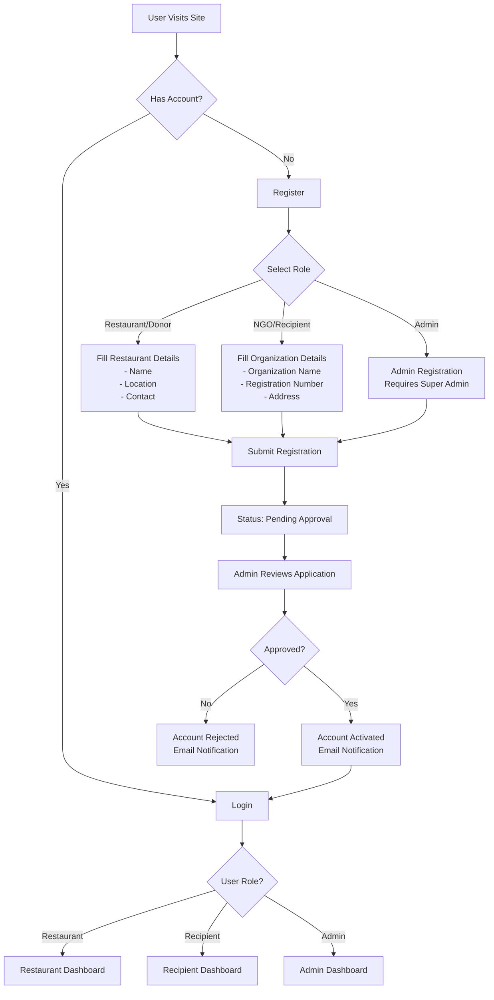
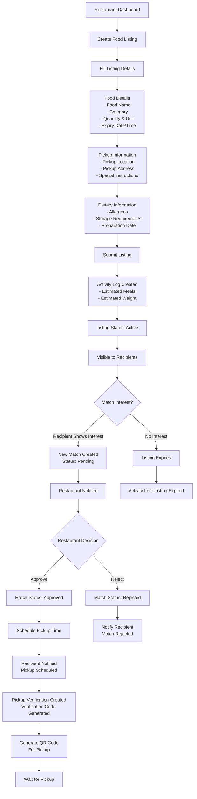
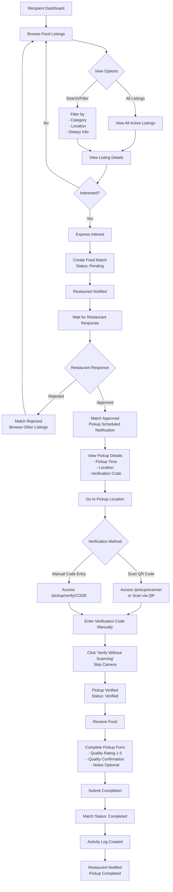
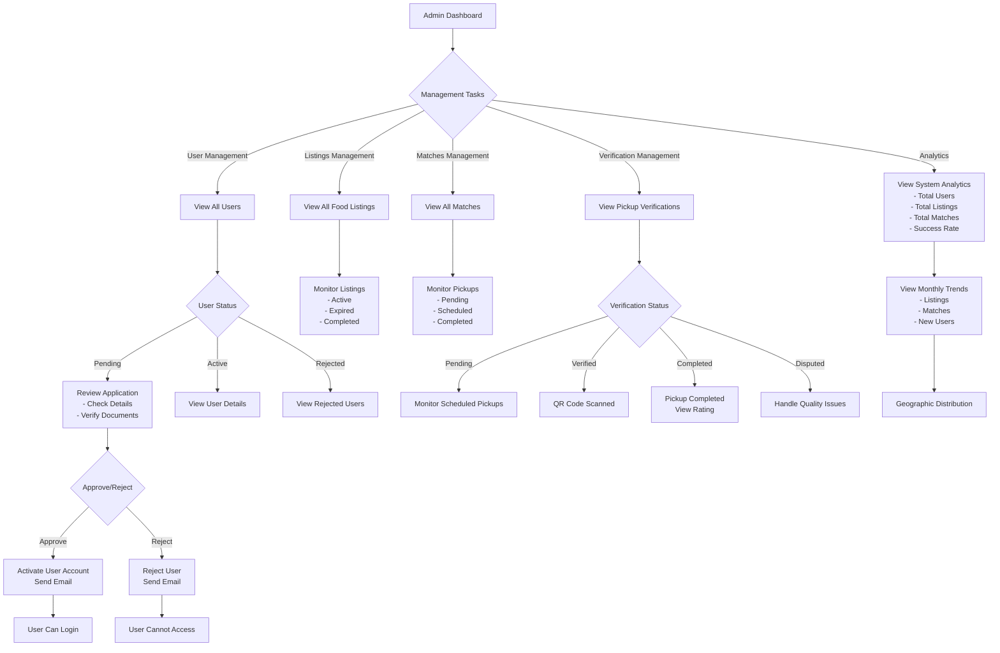
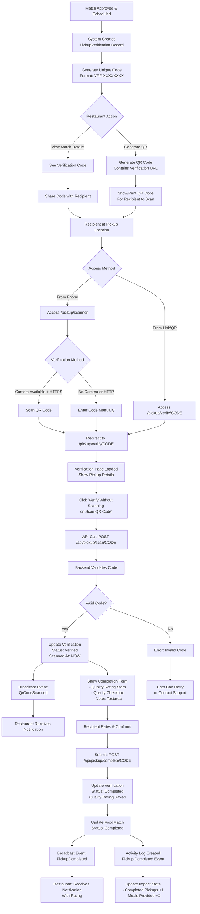
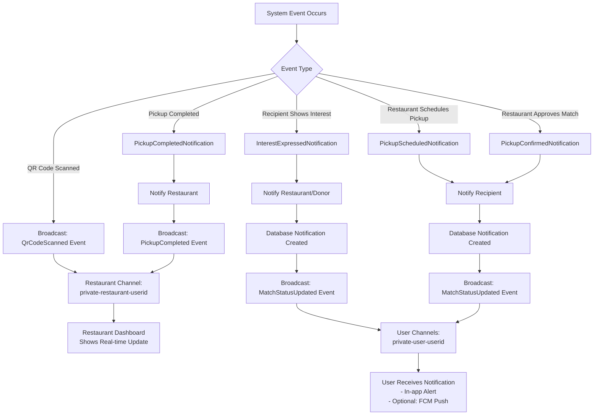
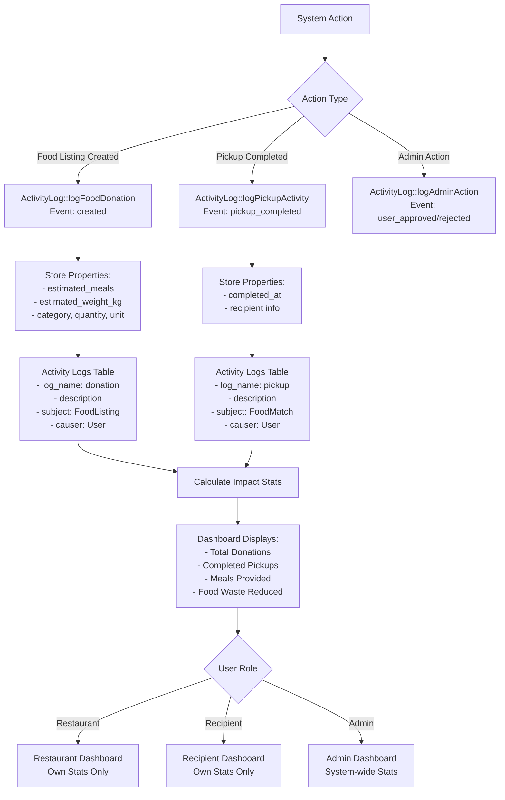
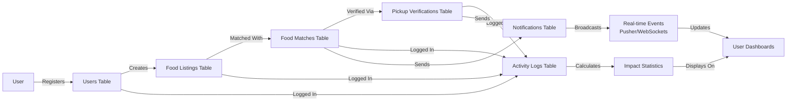

# MyFoodshare System Flowchart

## 1. User Registration & Authentication Flow

## 2. Restaurant/Donor Food Listing Flow

## 3. Recipient Food Discovery & Pickup Flow

## 4. Admin Management Flow

## 5. Pickup Verification Process Flow

## 6. Real-time Notification Flow

## 7. Activity Logging & Stats Flow

## 8. Data Flow Summary

## Key System Components

### Tables
- **users**: Restaurant owners, NGO recipients, admins
- **food_listings**: Available food donations
- **food_matches**: Interest/matches between listings and recipients
- **pickup_verifications**: QR code verification records
- **activity_logs**: System activity tracking
- **notifications**: User notifications

### Main Routes
- `/restaurant/*`: Restaurant/donor dashboard and management
- `/recipient/*`: Recipient/NGO dashboard and browsing
- `/admin/*`: Admin management panel
- `/pickup/scanner`: QR code scanner page
- `/pickup/verify/{code}`: Verification and completion page
- `/api/pickup/*`: Pickup verification APIs

### Real-time Events
- `MatchStatusUpdated`: When match status changes
- `QrCodeScanned`: When recipient scans QR code
- `PickupCompleted`: When pickup is completed

### Notifications
- `InterestExpressedNotification`: To donor when recipient shows interest
- `PickupScheduledNotification`: To recipient when pickup is scheduled
- `PickupConfirmedNotification`: To recipient when match is approved
