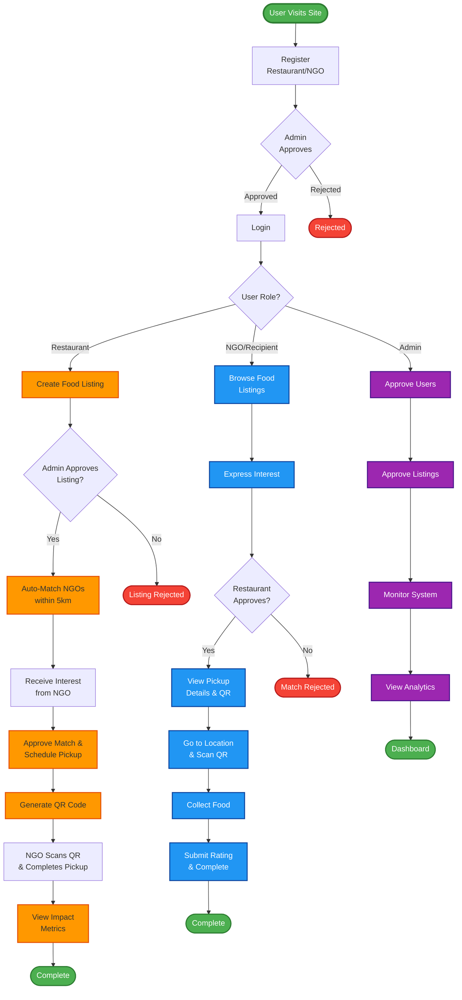

# MyFoodshare System Flowchart (Simplified)

## Complete System Flow - End-to-End

```mermaid
flowchart TD
    START([User Visits Site]) --> REGISTER[Register<br/>Restaurant/NGO]
    REGISTER --> ADMIN_APPROVE{Admin<br/>Approves}
    ADMIN_APPROVE -->|Approved| LOGIN[Login]
    ADMIN_APPROVE -->|Rejected| END1([Rejected])

    LOGIN --> ROLE{User Role?}

    %% Restaurant Flow
    ROLE -->|Restaurant| R1[Create Food Listing]
    R1 --> R2{Admin Approves<br/>Listing?}
    R2 -->|Yes| R3[Auto-Match NGOs<br/>within 5km]
    R2 -->|No| END2([Listing Rejected])
    R3 --> R4[Receive Interest<br/>from NGO]
    R4 --> R5[Approve Match &<br/>Schedule Pickup]
    R5 --> R6[Generate QR Code]
    R6 --> R7[NGO Scans QR<br/>& Completes Pickup]
    R7 --> R8[View Impact<br/>Metrics]
    R8 --> END3([Complete])

    %% Recipient Flow
    ROLE -->|NGO/Recipient| N1[Browse Food<br/>Listings]
    N1 --> N2[Express Interest]
    N2 --> N3{Restaurant<br/>Approves?}
    N3 -->|Yes| N4[View Pickup<br/>Details & QR]
    N3 -->|No| END4([Match Rejected])
    N4 --> N5[Go to Location<br/>& Scan QR]
    N5 --> N6[Collect Food]
    N6 --> N7[Submit Rating<br/>& Complete]
    N7 --> END5([Complete])

    %% Admin Flow
    ROLE -->|Admin| A1[Approve Users]
    A1 --> A2[Approve Listings]
    A2 --> A3[Monitor System]
    A3 --> A4[View Analytics]
    A4 --> END6([Dashboard])

    %% Styling
    style START fill:#4CAF50,stroke:#2E7D32,stroke-width:3px,color:#fff
    style R1 fill:#FF9800,stroke:#E65100,stroke-width:2px
    style R3 fill:#FF9800,stroke:#E65100,stroke-width:2px
    style R5 fill:#FF9800,stroke:#E65100,stroke-width:2px
    style R6 fill:#FF9800,stroke:#E65100,stroke-width:2px
    style R8 fill:#FF9800,stroke:#E65100,stroke-width:2px
    style N1 fill:#2196F3,stroke:#0D47A1,stroke-width:2px,color:#fff
    style N2 fill:#2196F3,stroke:#0D47A1,stroke-width:2px,color:#fff
    style N4 fill:#2196F3,stroke:#0D47A1,stroke-width:2px,color:#fff
    style N5 fill:#2196F3,stroke:#0D47A1,stroke-width:2px,color:#fff
    style N6 fill:#2196F3,stroke:#0D47A1,stroke-width:2px,color:#fff
    style N7 fill:#2196F3,stroke:#0D47A1,stroke-width:2px,color:#fff
    style A1 fill:#9C27B0,stroke:#4A148C,stroke-width:2px,color:#fff
    style A2 fill:#9C27B0,stroke:#4A148C,stroke-width:2px,color:#fff
    style A3 fill:#9C27B0,stroke:#4A148C,stroke-width:2px,color:#fff
    style A4 fill:#9C27B0,stroke:#4A148C,stroke-width:2px,color:#fff
    style END1 fill:#F44336,stroke:#B71C1C,stroke-width:2px,color:#fff
    style END2 fill:#F44336,stroke:#B71C1C,stroke-width:2px,color:#fff
    style END4 fill:#F44336,stroke:#B71C1C,stroke-width:2px,color:#fff
    style END3 fill:#4CAF50,stroke:#2E7D32,stroke-width:2px,color:#fff
    style END5 fill:#4CAF50,stroke:#2E7D32,stroke-width:2px,color:#fff
    style END6 fill:#4CAF50,stroke:#2E7D32,stroke-width:2px,color:#fff
```

---

## Key System Features

### 🍽️ Restaurant Journey
1. Register with business details
2. Create food listing (photos, GPS, expiry)
3. Wait for admin approval
4. Receive interest notifications from NGOs
5. Approve match & schedule pickup time
6. Generate QR code for verification
7. View impact metrics after completion

### 🎯 NGO/Recipient Journey
1. Register with organization details
2. Browse nearby food listings (5km radius)
3. Express interest in listings
4. Wait for restaurant approval
5. View pickup details and QR code
6. Scan QR at pickup location
7. Complete pickup form with rating

### ⚙️ Admin Journey
1. Approve/reject user registrations
2. Approve/reject food listings
3. Monitor active operations
4. Handle disputes and quality issues
5. View platform analytics

### 🔄 Automated System
- **Auto-Matching**: Uses Haversine formula to match listings with NGOs within 5km
- **Real-time Notifications**: Pusher WebSockets for instant updates
- **Activity Logging**: Tracks all actions for audit trail
- **Impact Metrics**: Calculates meals provided and food waste reduced

---

## Technology Stack

- **Backend**: Laravel 10.10 + PHP 8.1+
- **Frontend**: React 18.2 + TypeScript + Tailwind CSS
- **Real-time**: Pusher + Laravel Echo
- **Database**: MySQL
- **QR Codes**: SimpleSoftwareIO
- **Maps**: GPS coordinates with Haversine distance calculation

---

## Summary

This simplified flowchart provides a clear overview of the MyFoodshare food donation platform, showing how restaurants, NGOs, and admins interact within the system. The platform uses GPS-based matching, QR code verification, and real-time notifications to facilitate efficient food rescue operations.
