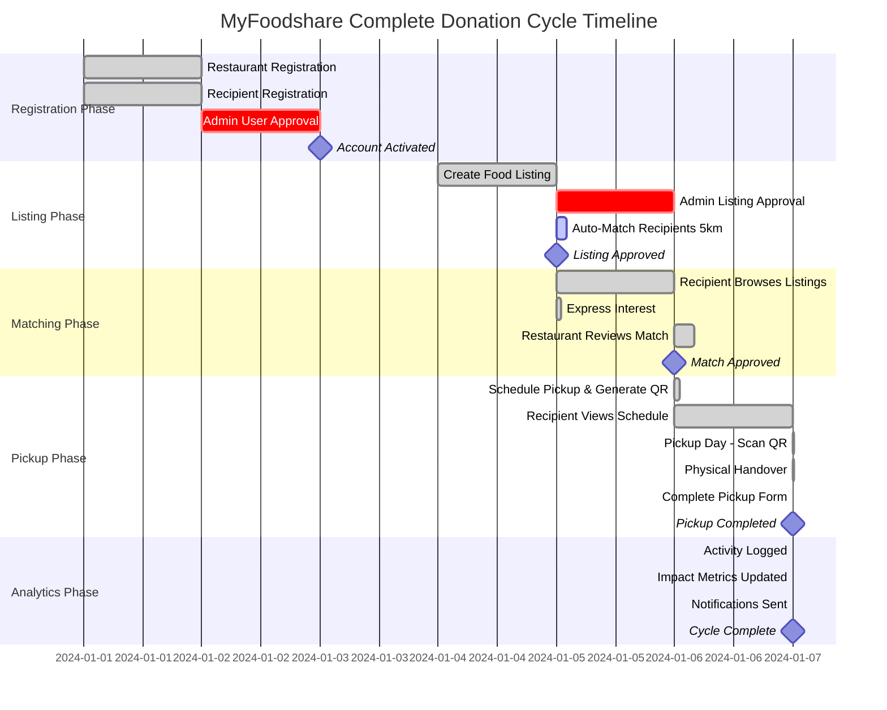
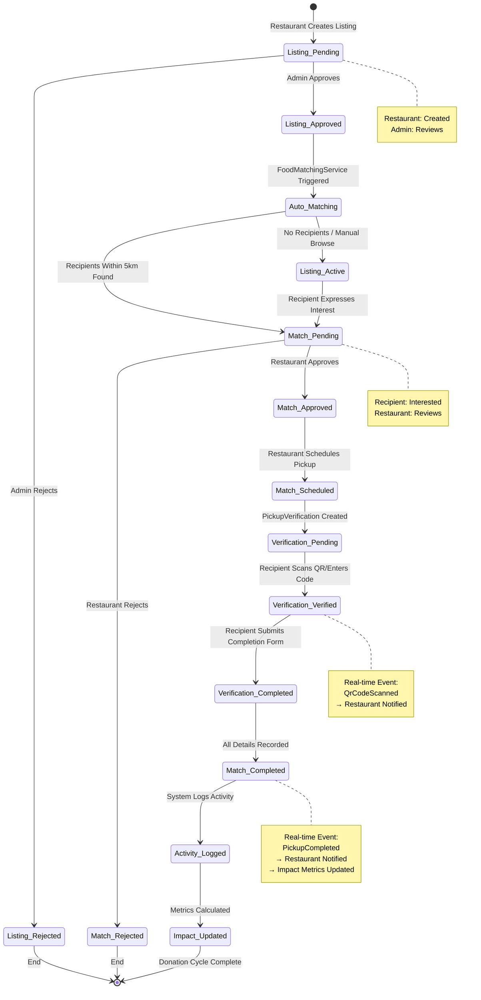
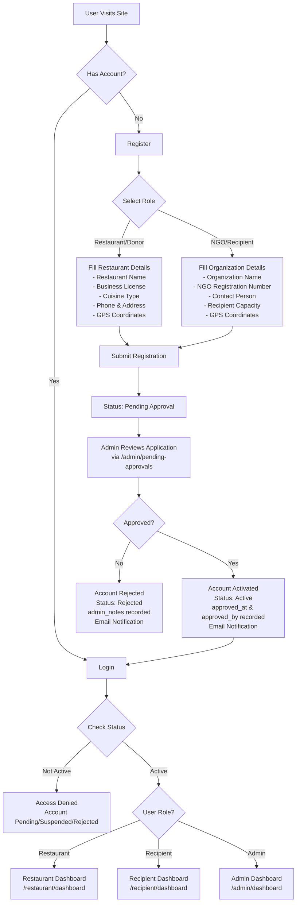
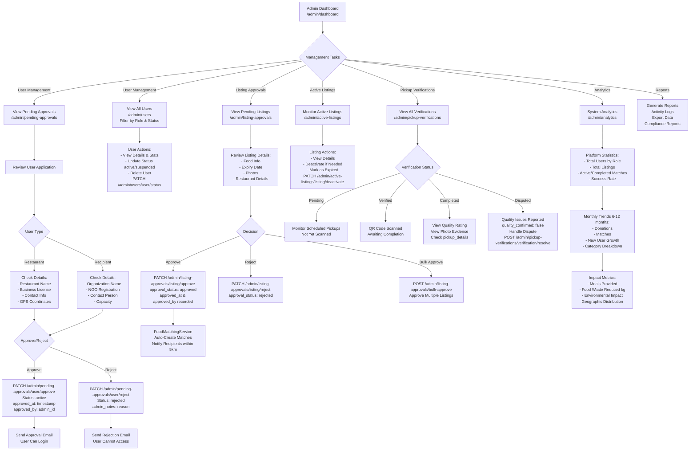
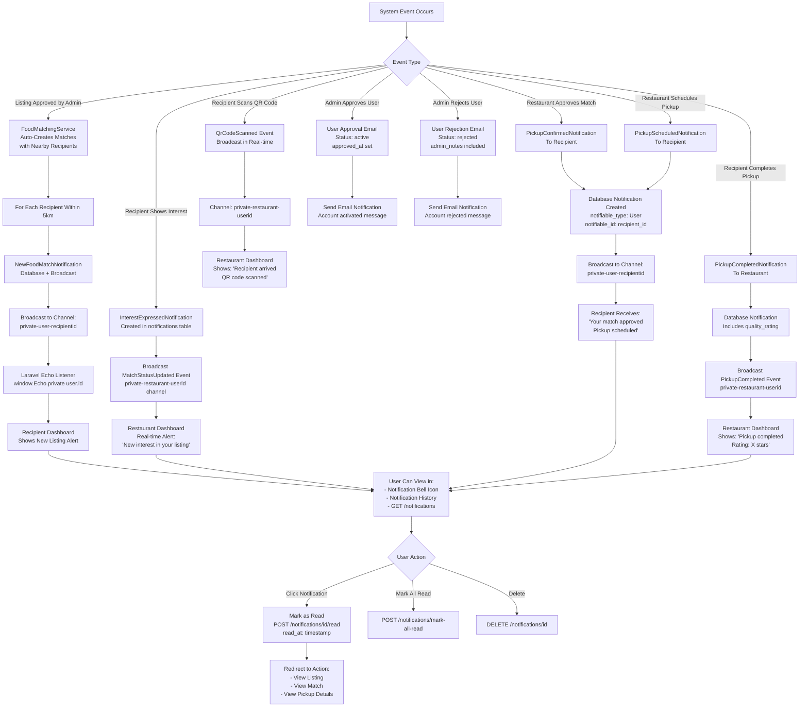
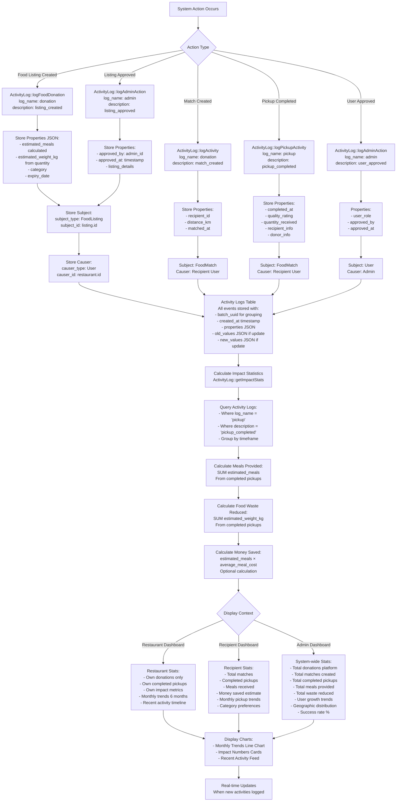
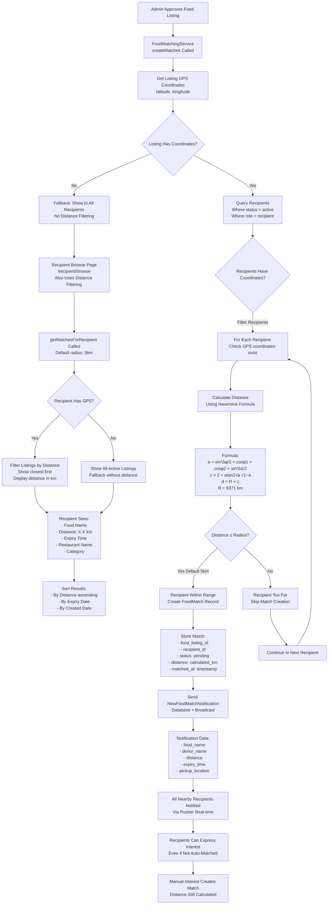

# MyFoodshare System Flowchart

## Overview: Complete System Flow (All Users Combined)

### Combined End-to-End User Journey

```mermaid
flowchart TD
    %% Registration & Login
    START([User Visits MyFoodshare]) --> CHECK{Has Account?}
    CHECK -->|No| REGISTER[Register]
    CHECK -->|Yes| LOGIN[Login]

    REGISTER --> ROLE{Select Role}
    ROLE -->|Restaurant| REG_REST[Register as Restaurant<br/>Business Details + GPS]
    ROLE -->|NGO| REG_NGO[Register as Recipient<br/>Organization Details + GPS]

    REG_REST --> PENDING[Status: Pending]
    REG_NGO --> PENDING

    %% Admin Approval
    PENDING --> ADMIN_REVIEW{Admin Reviews<br/>& Approves?}
    ADMIN_REVIEW -->|Reject| REJECTED([Account Rejected<br/>Email Sent])
    ADMIN_REVIEW -->|Approve| APPROVED[Status: Active<br/>Email Sent]

    APPROVED --> LOGIN
    LOGIN --> STATUS{Account<br/>Active?}
    STATUS -->|No| ACCESS_DENIED([Access Denied])
    STATUS -->|Yes| ROLE_CHECK{User Role?}

    %% Restaurant Flow
    ROLE_CHECK -->|Restaurant| REST_DASH[Restaurant Dashboard<br/>View Stats & Impact]
    REST_DASH --> REST_ACTION{Action?}
    REST_ACTION -->|Create Listing| CREATE_LIST[Create Food Listing<br/>Details + Photos + GPS]
    REST_ACTION -->|View Listings| VIEW_LIST[View My Listings]
    REST_ACTION -->|View Matches| VIEW_MATCH[View Match Requests]

    CREATE_LIST --> LIST_SUBMIT[Submit Listing<br/>Status: pending_approval]
    LIST_SUBMIT --> ADMIN_LIST{Admin Approves<br/>Listing?}
    ADMIN_LIST -->|Reject| LIST_REJECT([Listing Rejected])
    ADMIN_LIST -->|Approve| LIST_APPROVE[Listing Approved<br/>Status: approved]

    LIST_APPROVE --> AUTO_MATCH[FoodMatchingService<br/>Auto-Match Recipients<br/>within 5km Haversine]
    AUTO_MATCH --> NOTIFY_RECIP[Notify Nearby Recipients<br/>via Pusher Real-time]

    VIEW_MATCH --> MATCH_REVIEW{Review<br/>Recipient<br/>Interest}
    MATCH_REVIEW -->|Reject| MATCH_REJECT[Reject Match]
    MATCH_REVIEW -->|Approve| MATCH_APPROVE[Approve Match]

    MATCH_APPROVE --> SCHEDULE[Schedule Pickup Time<br/>Create Verification]
    SCHEDULE --> GEN_QR[Generate QR Code<br/>VRF-XXXXXXXX]
    GEN_QR --> NOTIFY_SCHED[Notify Recipient<br/>Pickup Scheduled]

    %% Recipient Flow
    ROLE_CHECK -->|Recipient| RECIP_DASH[Recipient Dashboard<br/>View Stats & Nearby]
    RECIP_DASH --> RECIP_ACTION{Action?}
    RECIP_ACTION -->|Browse Food| BROWSE[Browse Listings<br/>Filter by Distance 5km]
    RECIP_ACTION -->|Map View| MAP[View on Map<br/>GPS Markers]
    RECIP_ACTION -->|View Matches| MY_MATCHES[My Matches]

    NOTIFY_RECIP --> BROWSE
    BROWSE --> SEARCH{Search<br/>Options}
    SEARCH -->|Category| FILTER_CAT[Filter by Category]
    SEARCH -->|Keyword| FILTER_KEY[Search Keyword]
    SEARCH -->|Distance| FILTER_DIST[Adjust Radius]

    FILTER_CAT --> VIEW_DETAIL[View Listing Details<br/>Distance + Expiry]
    FILTER_KEY --> VIEW_DETAIL
    FILTER_DIST --> VIEW_DETAIL
    MAP --> VIEW_DETAIL

    VIEW_DETAIL --> INTEREST{Express<br/>Interest?}
    INTEREST -->|Yes| EXPRESS[Express Interest<br/>Create Match]
    INTEREST -->|No| BROWSE

    EXPRESS --> NOTIFY_REST[Notify Restaurant<br/>InterestExpressed]
    NOTIFY_REST --> WAIT_APPROVE[Wait for Restaurant<br/>Approval]

    WAIT_APPROVE --> MATCH_STATUS{Match<br/>Status?}
    MATCH_STATUS -->|Rejected| MATCH_REJECT
    MATCH_STATUS -->|Approved & Scheduled| NOTIFY_SCHED

    NOTIFY_SCHED --> MY_MATCHES
    MY_MATCHES --> PICKUP_TIME[View Pickup Details<br/>Time + Code + Location]
    PICKUP_TIME --> GO_PICKUP[Go to Pickup Location<br/>At Scheduled Time]

    GO_PICKUP --> VERIFY_METHOD{Verification<br/>Method?}
    VERIFY_METHOD -->|Scan QR| SCAN_QR[Scan QR Code<br/>Using Camera]
    VERIFY_METHOD -->|Manual| MANUAL_CODE[Enter Code Manually<br/>VRF-XXXXXXXX]

    SCAN_QR --> VERIFY_SUCCESS[Verification Success<br/>Status: verified]
    MANUAL_CODE --> VERIFY_SUCCESS

    VERIFY_SUCCESS --> BROADCAST_SCAN[Real-time Broadcast<br/>QrCodeScanned Event<br/>to Restaurant]
    BROADCAST_SCAN --> RECEIVE_FOOD[Receive Food<br/>Physical Handover]

    RECEIVE_FOOD --> COMPLETE_FORM[Complete Pickup Form<br/>- Quality Rating 1-5<br/>- Photo Evidence<br/>- Notes]
    COMPLETE_FORM --> SUBMIT_COMPLETE[Submit Completion]

    SUBMIT_COMPLETE --> UPDATE_RECORDS[Update Records<br/>Match: completed<br/>Verification: completed]
    UPDATE_RECORDS --> LOG_ACTIVITY[Activity Log Created<br/>Impact Metrics Updated]
    LOG_ACTIVITY --> BROADCAST_COMPLETE[Real-time Broadcast<br/>PickupCompleted Event<br/>to Restaurant]

    %% Admin Flow
    ROLE_CHECK -->|Admin| ADMIN_DASH[Admin Dashboard<br/>Platform Stats]
    ADMIN_DASH --> ADMIN_ACTION{Admin Action?}
    ADMIN_ACTION -->|Approve Users| ADMIN_REVIEW
    ADMIN_ACTION -->|Approve Listings| ADMIN_LIST
    ADMIN_ACTION -->|Monitor Active| MONITOR_ACTIVE[Monitor Active Listings<br/>Deactivate if Needed]
    ADMIN_ACTION -->|View Verifications| VIEW_VERIFY[View Pickup Verifications<br/>Handle Disputes]
    ADMIN_ACTION -->|Analytics| ANALYTICS[System Analytics<br/>Impact Metrics<br/>Geographic Distribution]

    %% Completion
    BROADCAST_COMPLETE --> REST_NOTIFIED[Restaurant Receives<br/>Completion Notification<br/>with Rating]
    REST_NOTIFIED --> IMPACT[Impact Stats Updated<br/>- Meals Provided<br/>- Waste Reduced]
    IMPACT --> END_SUCCESS([Donation Cycle Complete])

    LIST_REJECT --> REST_DASH
    MATCH_REJECT --> RECIP_DASH
    REJECTED --> START
    ACCESS_DENIED --> START

    %% Styling
    classDef startEnd fill:#4CAF50,stroke:#2E7D32,stroke-width:3px,color:#fff
    classDef restaurant fill:#FF9800,stroke:#E65100,stroke-width:2px
    classDef recipient fill:#2196F3,stroke:#0D47A1,stroke-width:2px
    classDef admin fill:#9C27B0,stroke:#4A148C,stroke-width:2px
    classDef system fill:#607D8B,stroke:#263238,stroke-width:2px
    classDef decision fill:#FFC107,stroke:#F57F17,stroke-width:2px
    classDef notification fill:#00BCD4,stroke:#006064,stroke-width:2px

    class START,END_SUCCESS startEnd
    class REST_DASH,REST_ACTION,CREATE_LIST,VIEW_LIST,VIEW_MATCH,MATCH_APPROVE,SCHEDULE,GEN_QR,REST_NOTIFIED restaurant
    class RECIP_DASH,RECIP_ACTION,BROWSE,MAP,MY_MATCHES,EXPRESS,PICKUP_TIME,GO_PICKUP,SCAN_QR,MANUAL_CODE,RECEIVE_FOOD,COMPLETE_FORM recipient
    class ADMIN_DASH,ADMIN_ACTION,ADMIN_REVIEW,ADMIN_LIST,MONITOR_ACTIVE,VIEW_VERIFY,ANALYTICS admin
    class AUTO_MATCH,VERIFY_SUCCESS,UPDATE_RECORDS,LOG_ACTIVITY,IMPACT system
    class CHECK,ROLE,STATUS,ROLE_CHECK,ADMIN_LIST,MATCH_REVIEW,MATCH_STATUS,VERIFY_METHOD,INTEREST,SEARCH decision
    class NOTIFY_RECIP,NOTIFY_REST,NOTIFY_SCHED,BROADCAST_SCAN,BROADCAST_COMPLETE notification
```

---

## Simplified 3-Actor Flow

```mermaid
flowchart LR
    subgraph RESTAURANT["🍽️ Restaurant/Donor Journey"]
        R1[Register<br/>Business Details]
        R2[Create Food<br/>Listing]
        R3[Admin Approval<br/>Required]
        R4[Review Recipient<br/>Interest]
        R5[Approve & Schedule<br/>Pickup]
        R6[Generate<br/>QR Code]
        R7[Receive Completion<br/>Notification]

        R1 --> R2 --> R3 --> R4 --> R5 --> R6 --> R7
    end

    subgraph RECIPIENT["🎯 Recipient/NGO Journey"]
        N1[Register<br/>Organization Details]
        N2[Browse Nearby<br/>Listings 5km]
        N3[Express<br/>Interest]
        N4[Wait for<br/>Approval]
        N5[View Pickup<br/>Details]
        N6[Scan QR<br/>or Enter Code]
        N7[Complete Pickup<br/>Rate Quality]

        N1 --> N2 --> N3 --> N4 --> N5 --> N6 --> N7
    end

    subgraph ADMIN["⚙️ Admin Journey"]
        A1[Review User<br/>Applications]
        A2[Approve/Reject<br/>Users]
        A3[Review Food<br/>Listings]
        A4[Approve/Reject<br/>Listings]
        A5[Monitor Active<br/>Operations]
        A6[Handle<br/>Disputes]
        A7[View Platform<br/>Analytics]

        A1 --> A2 --> A3 --> A4 --> A5 --> A6 --> A7
    end

    subgraph SYSTEM["🔄 Automated System"]
        S1[Auto-Match<br/>Recipients<br/>Haversine 5km]
        S2[Send Real-time<br/>Notifications<br/>Pusher]
        S3[Log Activities<br/>Audit Trail]
        S4[Calculate Impact<br/>Metrics]

        S1 --> S2 --> S3 --> S4
    end

    %% Cross-connections
    R3 -.Admin Reviews.-> A4
    A4 -.Approval Triggers.-> S1
    S1 -.Notifies.-> N2
    N3 -.Notifies.-> R4
    R5 -.Creates Verification.-> R6
    R6 -.Notifies.-> N5
    N6 -.Real-time Event.-> S2
    N7 -.Completion Event.-> R7
    N7 -.Updates.-> S3
    S3 -.Calculates.-> S4

    R1 & N1 -.Submit to.-> A1

    %% Styling
    classDef restaurantStyle fill:#FF9800,stroke:#E65100,stroke-width:2px,color:#000
    classDef recipientStyle fill:#2196F3,stroke:#0D47A1,stroke-width:2px,color:#fff
    classDef adminStyle fill:#9C27B0,stroke:#4A148C,stroke-width:2px,color:#fff
    classDef systemStyle fill:#607D8B,stroke:#263238,stroke-width:2px,color:#fff

    class R1,R2,R3,R4,R5,R6,R7 restaurantStyle
    class N1,N2,N3,N4,N5,N6,N7 recipientStyle
    class A1,A2,A3,A4,A5,A6,A7 adminStyle
    class S1,S2,S3,S4 systemStyle
```

---

## Timeline View: Complete Donation Cycle

```mermaid
gantt
    title MyFoodshare Complete Donation Cycle Timeline
    dateFormat YYYY-MM-DD

    section Registration Phase
    Restaurant Registration          :done, r1, 2024-01-01, 1d
    Recipient Registration           :done, n1, 2024-01-01, 1d
    Admin User Approval             :crit, a1, 2024-01-02, 1d
    Account Activated               :milestone, m1, 2024-01-03, 0d

    section Listing Phase
    Create Food Listing             :done, r2, 2024-01-04, 1d
    Admin Listing Approval          :crit, a2, 2024-01-05, 1d
    Auto-Match Recipients 5km       :active, s1, 2024-01-05, 2h
    Listing Approved                :milestone, m2, 2024-01-05, 0d

    section Matching Phase
    Recipient Browses Listings      :done, n2, 2024-01-05, 1d
    Express Interest                :done, n3, 2024-01-05, 1h
    Restaurant Reviews Match        :done, r3, 2024-01-06, 4h
    Match Approved                  :milestone, m3, 2024-01-06, 0d

    section Pickup Phase
    Schedule Pickup & Generate QR   :done, r4, 2024-01-06, 1h
    Recipient Views Schedule        :done, n4, 2024-01-06, 1d
    Pickup Day - Scan QR            :done, n5, 2024-01-07, 10m
    Physical Handover               :done, n6, 2024-01-07, 15m
    Complete Pickup Form            :done, n7, 2024-01-07, 5m
    Pickup Completed                :milestone, m4, 2024-01-07, 0d

    section Analytics Phase
    Activity Logged                 :done, s2, 2024-01-07, 1m
    Impact Metrics Updated          :done, s3, 2024-01-07, 1m
    Notifications Sent              :done, s4, 2024-01-07, 1m
    Cycle Complete                  :milestone, m5, 2024-01-07, 0d
```

---

## State Diagram: Match Lifecycle (All Users Perspective)

```mermaid
stateDiagram-v2
    [*] --> Listing_Pending: Restaurant Creates Listing

    Listing_Pending --> Listing_Rejected: Admin Rejects
    Listing_Pending --> Listing_Approved: Admin Approves
    Listing_Rejected --> [*]: End

    Listing_Approved --> Auto_Matching: FoodMatchingService Triggered
    Auto_Matching --> Match_Pending: Recipients Within 5km Found
    Auto_Matching --> Listing_Active: No Recipients / Manual Browse

    Listing_Active --> Match_Pending: Recipient Expresses Interest

    Match_Pending --> Match_Rejected: Restaurant Rejects
    Match_Pending --> Match_Approved: Restaurant Approves
    Match_Rejected --> [*]: End

    Match_Approved --> Match_Scheduled: Restaurant Schedules Pickup

    Match_Scheduled --> Verification_Pending: PickupVerification Created
    Verification_Pending --> Verification_Verified: Recipient Scans QR/Enters Code

    Verification_Verified --> Verification_Completed: Recipient Submits Completion Form

    Verification_Completed --> Match_Completed: All Details Recorded
    Match_Completed --> Activity_Logged: System Logs Activity
    Activity_Logged --> Impact_Updated: Metrics Calculated
    Impact_Updated --> [*]: Donation Cycle Complete

    note right of Listing_Pending
        Restaurant: Created
        Admin: Reviews
    end note

    note right of Match_Pending
        Recipient: Interested
        Restaurant: Reviews
    end note

    note right of Verification_Verified
        Real-time Event:
        QrCodeScanned
        → Restaurant Notified
    end note

    note right of Match_Completed
        Real-time Event:
        PickupCompleted
        → Restaurant Notified
        → Impact Metrics Updated
    end note
```

---

## Detailed Individual Flows (Original)

## 1. User Registration & Authentication Flow

```mermaid
flowchart TD
    A[User Visits Site] --> B{Has Account?}
    B -->|No| C[Register]
    B -->|Yes| D[Login]

    C --> E{Select Role}
    E -->|Restaurant/Donor| F[Fill Restaurant Details<br/>- Restaurant Name<br/>- Business License<br/>- Cuisine Type<br/>- Phone & Address<br/>- GPS Coordinates]
    E -->|NGO/Recipient| G[Fill Organization Details<br/>- Organization Name<br/>- NGO Registration Number<br/>- Contact Person<br/>- Recipient Capacity<br/>- GPS Coordinates]

    F --> I[Submit Registration]
    G --> I

    I --> J[Status: Pending Approval]
    J --> K[Admin Reviews Application<br/>via /admin/pending-approvals]

    K --> L{Approved?}
    L -->|Yes| M[Account Activated<br/>Status: Active<br/>approved_at & approved_by recorded<br/>Email Notification]
    L -->|No| N[Account Rejected<br/>Status: Rejected<br/>admin_notes recorded<br/>Email Notification]

    M --> D
    D --> O{Check Status}
    O -->|Not Active| P[Access Denied<br/>Account Pending/Suspended/Rejected]
    O -->|Active| Q{User Role?}
    Q -->|Restaurant| R[Restaurant Dashboard<br/>/restaurant/dashboard]
    Q -->|Recipient| S[Recipient Dashboard<br/>/recipient/dashboard]
    Q -->|Admin| T[Admin Dashboard<br/>/admin/dashboard]
```

## 2. Restaurant/Donor Food Listing Flow

```mermaid
flowchart TD
    A[Restaurant Dashboard] --> B[Create Food Listing<br/>/restaurant/listings/create]
    B --> C[Fill Listing Details]

    C --> D[Food Details<br/>- Food Name<br/>- Description<br/>- Category<br/>- Quantity & Unit<br/>- Expiry Date/Time]
    D --> E[Pickup Information<br/>- Pickup Location<br/>- GPS Coordinates lat/lng<br/>- Pickup Address<br/>- Special Instructions]
    E --> F[Additional Information<br/>- Dietary Info JSON<br/>- Upload Photos max 5<br/>- Storage Requirements]

    F --> G[Submit Listing<br/>POST /restaurant/listings]
    G --> H[Listing Created<br/>approval_status: pending_approval<br/>Activity Log Created]

    H --> I[Admin Reviews Listing<br/>/admin/listing-approvals]
    I --> J{Admin Decision}

    J -->|Reject| K[Listing Rejected<br/>approval_status: rejected<br/>Donor Notified]
    J -->|Approve| L[Listing Approved<br/>approval_status: approved<br/>approved_at & approved_by recorded]

    L --> M[FoodMatchingService<br/>Auto-Matches Nearby Recipients]
    M --> N[Find Recipients Within 5km<br/>Using Haversine Formula]
    N --> O{Recipients Found?}

    O -->|Yes| P[Create FoodMatch Records<br/>Status: pending<br/>Distance Calculated]
    O -->|No| Q[Listing Visible<br/>No Auto-Matches Created]

    P --> R[Send NewFoodMatchNotification<br/>to Nearby Recipients<br/>via Pusher Broadcast]

    Q --> S[Recipients Can Browse<br/>/recipient/browse]
    R --> S

    S --> T{Recipient Action}
    T -->|Express Interest| U[Create/Update Match<br/>Status: pending<br/>POST /recipient/browse/listing/interest]
    T -->|No Interest| V[Match Remains Pending]

    U --> W[InterestExpressedNotification<br/>Sent to Restaurant]
    W --> X[Restaurant Reviews Match<br/>/restaurant/matches]

    X --> Y{Restaurant Decision}
    Y -->|Approve| Z[Match Status: approved<br/>PATCH /restaurant/listings/id/matches/match/approve]
    Y -->|Reject| AA[Match Status: rejected<br/>PATCH /restaurant/listings/id/matches/match/reject<br/>Recipient Notified]

    Z --> AB[Schedule Pickup<br/>PATCH /restaurant/listings/id/matches/match/schedule<br/>pickup_scheduled_at set]
    AB --> AC[Create PickupVerification<br/>verification_code: VRF-XXXXXXXX<br/>verification_status: pending]

    AC --> AD[Generate QR Code<br/>POST /api/restaurant/listings/listing/generate-qr<br/>qr_code_data JSON stored]
    AD --> AE[PickupScheduledNotification<br/>Sent to Recipient with Details]
    AE --> AF[Wait for Pickup]

    V --> AG[Listing Expires After expiry_time]
    AA --> S
    K --> AH[Listing Not Visible to Recipients]
```

## 3. Recipient Food Discovery & Pickup Flow

```mermaid
flowchart TD
    A[Recipient Dashboard<br/>/recipient/dashboard] --> B[Browse Food Listings<br/>/recipient/browse]

    B --> C{View Options}
    C -->|All Listings| D[FoodMatchingService<br/>getMatchesForRecipient<br/>Filter by Distance default 5km]
    C -->|Search/Filter| E[Filter by<br/>- Category<br/>- Keyword Search<br/>- Location Radius]
    C -->|Map View| F[View on Map<br/>/recipient/browse/map<br/>GPS-Based Locations]

    D --> G[View Listing Details<br/>/recipient/browse/listing]
    E --> G
    F --> G

    G --> H{Interested?}
    H -->|No| B
    H -->|Yes| I[Express Interest<br/>POST /recipient/browse/listing/interest]

    I --> J[Create/Update Food Match<br/>Status: pending<br/>Distance Calculated]
    J --> K[InterestExpressedNotification<br/>Sent to Restaurant via Pusher]
    K --> L[Wait for Restaurant Response]

    L --> M{Restaurant Response}
    M -->|Rejected| N[Match Status: rejected<br/>Notification Received<br/>Browse Other Listings]
    M -->|Approved & Scheduled| O[Match Status: scheduled<br/>PickupScheduledNotification<br/>pickup_scheduled_at set]

    O --> P[View Match Details<br/>/recipient/matches]
    P --> Q[View Pickup Information<br/>- Pickup Time<br/>- Location & Address<br/>- Verification Code<br/>- QR Code]

    Q --> R[Go to Pickup Location<br/>At Scheduled Time]
    R --> S{Verification Method}

    S -->|Scan QR Code| T[Access QR Scanner<br/>/pickup/scanner<br/>Camera Permission Required]
    S -->|Manual Code Entry| U[Access Verification Page<br/>/pickup/verify/CODE]

    T --> V[Scan QR Code with Camera<br/>Or Click 'Verify Without Scanning']
    V --> W[API Call:<br/>POST /api/pickup/scan/CODE<br/>With Optional Location Data]

    U --> W
    W --> X{Valid Code?}

    X -->|Invalid| Y[Error: Invalid or Expired Code<br/>Contact Restaurant]
    X -->|Valid| Z[Verification Updated<br/>qr_code_scanned: true<br/>scanned_at: timestamp<br/>verification_status: verified]

    Z --> AA[Broadcast QrCodeScanned Event<br/>Restaurant Notified in Real-time]
    AA --> AB[Show Pickup Completion Form<br/>verification/details page]

    AB --> AC[Receive Food<br/>Fill Completion Form:<br/>- Quantity Received<br/>- Quality Rating 1-5 stars<br/>- quality_confirmed boolean<br/>- Photo Evidence Optional<br/>- Recipient Notes]

    AC --> AD[Submit Completion<br/>POST /api/pickup/complete/CODE<br/>or PATCH /recipient/matches/match/complete]

    AD --> AE[Update PickupVerification<br/>pickup_completed_at: timestamp<br/>quality_rating saved<br/>pickup_details JSON<br/>photo_evidence JSON array]

    AE --> AF[Update FoodMatch<br/>Status: completed<br/>completed_at: timestamp]

    AF --> AG[Activity Log Created<br/>logPickupActivity<br/>Event: pickup_completed]

    AG --> AH[Broadcast PickupCompleted Event<br/>PickupCompletedNotification to Restaurant]

    AH --> AI[Update Impact Metrics<br/>- Meals Provided +X<br/>- Food Waste Reduced +Y kg]

    AI --> AJ[Pickup Complete<br/>Visible in History<br/>/recipient/matches]

    N --> B
    Y --> AK[Retry or Contact Support]
```

## 4. Admin Management Flow

```mermaid
flowchart TD
    A[Admin Dashboard<br/>/admin/dashboard] --> B{Management Tasks}

    B -->|User Management| C[View Pending Approvals<br/>/admin/pending-approvals]
    C --> D[Review User Application]
    D --> E{User Type}
    E -->|Restaurant| F[Check Details:<br/>- Restaurant Name<br/>- Business License<br/>- Contact Info<br/>- GPS Coordinates]
    E -->|Recipient| G[Check Details:<br/>- Organization Name<br/>- NGO Registration<br/>- Contact Person<br/>- Capacity]

    F --> H{Approve/Reject}
    G --> H
    H -->|Approve| I[PATCH /admin/pending-approvals/user/approve<br/>Status: active<br/>approved_at: timestamp<br/>approved_by: admin_id]
    H -->|Reject| J[PATCH /admin/pending-approvals/user/reject<br/>Status: rejected<br/>admin_notes: reason]

    I --> K[Send Approval Email<br/>User Can Login]
    J --> L[Send Rejection Email<br/>User Cannot Access]

    B -->|User Management| M[View All Users<br/>/admin/users<br/>Filter by Role & Status]
    M --> N[User Actions:<br/>- View Details & Stats<br/>- Update Status active/suspended<br/>- Delete User<br/>PATCH /admin/users/user/status]

    B -->|Listing Approvals| O[View Pending Listings<br/>/admin/listing-approvals]
    O --> P[Review Listing Details:<br/>- Food Info<br/>- Expiry Date<br/>- Photos<br/>- Restaurant Details]
    P --> Q{Decision}
    Q -->|Approve| R[PATCH /admin/listing-approvals/listing/approve<br/>approval_status: approved<br/>approved_at & approved_by recorded]
    Q -->|Reject| S[PATCH /admin/listing-approvals/listing/reject<br/>approval_status: rejected]
    Q -->|Bulk Approve| T[POST /admin/listing-approvals/bulk-approve<br/>Approve Multiple Listings]

    R --> U[FoodMatchingService<br/>Auto-Create Matches<br/>Notify Recipients within 5km]

    B -->|Active Listings| V[Monitor Active Listings<br/>/admin/active-listings]
    V --> W[Listing Actions:<br/>- View Details<br/>- Deactivate if Needed<br/>- Mark as Expired<br/>PATCH /admin/active-listings/listing/deactivate]

    B -->|Pickup Verifications| X[View All Verifications<br/>/admin/pickup-verifications]
    X --> Y{Verification Status}
    Y -->|Pending| Z[Monitor Scheduled Pickups<br/>Not Yet Scanned]
    Y -->|Verified| AA[QR Code Scanned<br/>Awaiting Completion]
    Y -->|Completed| AB[View Quality Rating<br/>View Photo Evidence<br/>Check pickup_details]
    Y -->|Disputed| AC[Quality Issues Reported<br/>quality_confirmed: false<br/>Handle Dispute<br/>POST /admin/pickup-verifications/verification/resolve]

    B -->|Analytics| AD[System Analytics<br/>/admin/analytics]
    AD --> AE[Platform Statistics:<br/>- Total Users by Role<br/>- Total Listings<br/>- Active/Completed Matches<br/>- Success Rate]
    AE --> AF[Monthly Trends 6-12 months:<br/>- Donations<br/>- Matches<br/>- New User Growth<br/>- Category Breakdown]
    AF --> AG[Impact Metrics:<br/>- Meals Provided<br/>- Food Waste Reduced kg<br/>- Environmental Impact<br/>Geographic Distribution]

    B -->|Reports| AH[Generate Reports<br/>Activity Logs<br/>Export Data<br/>Compliance Reports]
```

## 5. Pickup Verification Process Flow (QR Code System)

```mermaid
flowchart TD
    A[Match Approved & Scheduled<br/>pickup_scheduled_at set] --> B[System Creates PickupVerification<br/>Record in pickup_verifications table]
    B --> C[Generate Unique Code<br/>verification_code: VRF-XXXXXXXX<br/>verification_status: pending]

    C --> D[Store Match Details<br/>food_match_id<br/>food_listing_id<br/>recipient_id<br/>donor_id]

    D --> E{Restaurant Action}
    E -->|View Match| F[See Verification Code<br/>/restaurant/matches]
    E -->|Generate QR| G[POST /api/restaurant/listings/listing/generate-qr<br/>Create QR Code Image]

    G --> H[QR Code Contains URL:<br/>/pickup/verify/CODE<br/>qr_code_data stored as JSON]
    H --> I[Display/Print QR Code<br/>For Recipient to Scan]

    F --> J[Share Code with Recipient<br/>Via Notification]
    I --> J

    J --> K[Recipient at Pickup Location<br/>At Scheduled Time]
    K --> L{Access Method}

    L -->|Mobile Phone| M[Access QR Scanner<br/>/pickup/scanner]
    L -->|Direct Link/QR Scan| N[Access Verification Page<br/>/pickup/verify/CODE]
    L -->|From Notification| N

    M --> O{Camera Available?}
    O -->|Yes HTTPS| P[Scan QR Code with Camera<br/>Uses HTML5 Camera API]
    O -->|No or HTTP| Q[Click 'Verify Without Scanning'<br/>Manual Code Entry]

    P --> R[Extract CODE from QR<br/>Redirect to /pickup/verify/CODE]
    Q --> R

    N --> R
    R --> S[Verification Page Loads<br/>Display Pickup Details:<br/>- Food Name<br/>- Restaurant<br/>- Quantity<br/>- Pickup Location]

    S --> T[Click Verify Button<br/>or 'Scan QR Code' Button]
    T --> U[API Call:<br/>POST /api/pickup/scan/CODE<br/>Optional: location_data JSON]

    U --> V{Validate Code}
    V -->|Invalid| W[Error Response:<br/>- Code Not Found<br/>- Already Used<br/>- Expired Match]
    V -->|Valid| X[Update PickupVerification:<br/>qr_code_scanned: true<br/>scanned_at: timestamp<br/>verification_status: verified<br/>location_data: JSON if provided]

    X --> Y[Broadcast Event:<br/>QrCodeScanned<br/>Channel: private-restaurant-userid]
    Y --> Z[Restaurant Dashboard<br/>Real-time Update:<br/>'Recipient has arrived']

    X --> AA[Show Completion Form<br/>GET /pickup/verification/verification/details]
    AA --> AB[Recipient Completes Form:<br/>- Quantity Received confirmation<br/>- Quality Rating Stars 1-5<br/>- quality_confirmed checkbox<br/>- Photo Evidence Upload Optional<br/>- recipient_notes textarea<br/>- quality_issues if any]

    AB --> AC[Submit Completion<br/>POST /api/pickup/complete/CODE<br/>or POST /pickup/verification/verification/complete]

    AC --> AD{Validation}
    AD -->|Missing Required Fields| AE[Error: Quality Rating Required]
    AD -->|Complete| AF[Update PickupVerification:<br/>pickup_completed_at: timestamp<br/>quality_rating: 1-5<br/>quality_confirmed: boolean<br/>pickup_details: JSON<br/>photo_evidence: JSON array<br/>recipient_notes: text<br/>verification_status: completed]

    AF --> AG[Update FoodMatch:<br/>status: completed<br/>completed_at: timestamp]

    AG --> AH[Activity Log:<br/>logPickupActivity<br/>log_name: pickup<br/>description: pickup_completed<br/>properties: meal count, weight]

    AH --> AI[Broadcast Event:<br/>PickupCompleted<br/>Channel: private-restaurant-userid]
    AI --> AJ[PickupCompletedNotification<br/>Sent to Restaurant<br/>Includes Quality Rating]

    AH --> AK[Update Impact Statistics:<br/>- Completed Pickups +1<br/>- Meals Provided +X<br/>- Food Waste Reduced +Y kg<br/>- Money Saved Estimate]

    AK --> AL[Pickup Complete<br/>Visible in:<br/>- Restaurant Reports<br/>- Recipient History<br/>- Admin Analytics]

    W --> AM[Display Error Message<br/>User Can Retry or Contact Support]
    AE --> AB
```

## 6. Real-time Notification Flow (Pusher/Laravel Echo)

```mermaid
flowchart TD
    A[System Event Occurs] --> B{Event Type}

    B -->|Listing Approved by Admin| C[FoodMatchingService<br/>Auto-Creates Matches<br/>with Nearby Recipients]
    C --> D[For Each Recipient Within 5km]
    D --> E[NewFoodMatchNotification<br/>Database + Broadcast]
    E --> F[Broadcast to Channel:<br/>private-user-recipientid]
    F --> G[Laravel Echo Listener<br/>window.Echo.private user.id]
    G --> H[Recipient Dashboard<br/>Shows New Listing Alert]

    B -->|Recipient Shows Interest| I[InterestExpressedNotification<br/>Created in notifications table]
    I --> J[Broadcast MatchStatusUpdated Event<br/>private-restaurant-userid channel]
    J --> K[Restaurant Dashboard<br/>Real-time Alert:<br/>'New interest in your listing']

    B -->|Restaurant Approves Match| L[PickupConfirmedNotification<br/>To Recipient]
    L --> M[Database Notification Created<br/>notifiable_type: User<br/>notifiable_id: recipient_id]
    M --> N[Broadcast to Channel:<br/>private-user-recipientid]
    N --> O[Recipient Receives:<br/>'Your match approved<br/>Pickup scheduled']

    B -->|Restaurant Schedules Pickup| P[PickupScheduledNotification<br/>To Recipient]
    P --> M

    B -->|Recipient Scans QR Code| Q[QrCodeScanned Event<br/>Broadcast in Real-time]
    Q --> R[Channel: private-restaurant-userid]
    R --> S[Restaurant Dashboard<br/>Shows: 'Recipient arrived<br/>QR code scanned']

    B -->|Recipient Completes Pickup| T[PickupCompletedNotification<br/>To Restaurant]
    T --> U[Database Notification<br/>Includes quality_rating]
    U --> V[Broadcast PickupCompleted Event<br/>private-restaurant-userid]
    V --> W[Restaurant Dashboard<br/>Shows: 'Pickup completed<br/>Rating: X stars']

    B -->|Admin Approves User| X[User Approval Email<br/>Status: active<br/>approved_at set]
    X --> Y[Send Email Notification<br/>Account activated message]

    B -->|Admin Rejects User| Z[User Rejection Email<br/>Status: rejected<br/>admin_notes included]
    Z --> AA[Send Email Notification<br/>Account rejected message]

    H --> AB[User Can View in:<br/>- Notification Bell Icon<br/>- Notification History<br/>- GET /notifications]
    K --> AB
    O --> AB
    W --> AB

    AB --> AC{User Action}
    AC -->|Click Notification| AD[Mark as Read<br/>POST /notifications/id/read<br/>read_at: timestamp]
    AC -->|Mark All Read| AE[POST /notifications/mark-all-read]
    AC -->|Delete| AF[DELETE /notifications/id]

    AD --> AG[Redirect to Action:<br/>- View Listing<br/>- View Match<br/>- View Pickup Details]
```

## 7. Activity Logging & Impact Metrics Flow

```mermaid
flowchart TD
    A[System Action Occurs] --> B{Action Type}

    B -->|Food Listing Created| C[ActivityLog::logFoodDonation<br/>log_name: donation<br/>description: listing_created]
    C --> D[Store Properties JSON:<br/>- estimated_meals calculated<br/>- estimated_weight_kg from quantity<br/>- category<br/>- expiry_date]
    D --> E[Store Subject:<br/>subject_type: FoodListing<br/>subject_id: listing.id]
    E --> F[Store Causer:<br/>causer_type: User<br/>causer_id: restaurant.id]

    B -->|Listing Approved| G[ActivityLog::logAdminAction<br/>log_name: admin<br/>description: listing_approved]
    G --> H[Store Properties:<br/>- approved_by: admin_id<br/>- approved_at: timestamp<br/>- listing_details]
    H --> E

    B -->|Match Created| I[ActivityLog::logActivity<br/>log_name: donation<br/>description: match_created]
    I --> J[Store Properties:<br/>- recipient_id<br/>- distance_km<br/>- matched_at]
    J --> K[Subject: FoodMatch<br/>Causer: Recipient User]

    B -->|Pickup Completed| L[ActivityLog::logPickupActivity<br/>log_name: pickup<br/>description: pickup_completed]
    L --> M[Store Properties:<br/>- completed_at<br/>- quality_rating<br/>- quantity_received<br/>- recipient_info<br/>- donor_info]
    M --> N[Subject: FoodMatch<br/>Causer: Recipient User]

    B -->|User Approved| O[ActivityLog::logAdminAction<br/>log_name: admin<br/>description: user_approved]
    O --> P[Properties:<br/>- user_role<br/>- approved_by<br/>- approved_at]
    P --> Q[Subject: User<br/>Causer: Admin]

    F --> R[Activity Logs Table<br/>All events stored with:<br/>- batch_uuid for grouping<br/>- created_at timestamp<br/>- properties JSON<br/>- old_values JSON if update<br/>- new_values JSON if update]
    K --> R
    N --> R
    Q --> R

    R --> S[Calculate Impact Statistics<br/>ActivityLog::getImpactStats]
    S --> T[Query Activity Logs:<br/>- Where log_name = 'pickup'<br/>- Where description = 'pickup_completed'<br/>- Group by timeframe]

    T --> U[Calculate Meals Provided:<br/>SUM estimated_meals<br/>From completed pickups]
    U --> V[Calculate Food Waste Reduced:<br/>SUM estimated_weight_kg<br/>From completed pickups]
    V --> W[Calculate Money Saved:<br/>estimated_meals × average_meal_cost<br/>Optional calculation]

    W --> X{Display Context}
    X -->|Restaurant Dashboard| Y[Restaurant Stats:<br/>- Own donations only<br/>- Own completed pickups<br/>- Own impact metrics<br/>- Monthly trends 6 months<br/>- Recent activity timeline]

    X -->|Recipient Dashboard| Z[Recipient Stats:<br/>- Total matches<br/>- Completed pickups<br/>- Meals received<br/>- Money saved estimate<br/>- Monthly pickup trends<br/>- Category preferences]

    X -->|Admin Dashboard| AA[System-wide Stats:<br/>- Total donations platform<br/>- Total matches created<br/>- Total completed pickups<br/>- Total meals provided<br/>- Total waste reduced<br/>- User growth trends<br/>- Geographic distribution<br/>- Success rate %]

    Y --> AB[Display Charts:<br/>- Monthly Trends Line Chart<br/>- Impact Numbers Cards<br/>- Recent Activity Feed]
    Z --> AB
    AA --> AB

    AB --> AC[Real-time Updates<br/>When new activities logged]
```

## 8. Geographic Matching Flow (Haversine Distance)

```mermaid
flowchart TD
    A[Admin Approves Food Listing] --> B[FoodMatchingService<br/>createMatches Called]
    B --> C[Get Listing GPS Coordinates<br/>latitude, longitude]

    C --> D{Listing Has Coordinates?}
    D -->|No| E[Fallback: Show to All Recipients<br/>No Distance Filtering]
    D -->|Yes| F[Query Recipients<br/>Where status = active<br/>Where role = recipient]

    F --> G{Recipients Have Coordinates?}
    G -->|Filter Recipients| H[For Each Recipient:<br/>Check GPS coordinates exist]

    H --> I[Calculate Distance<br/>Using Haversine Formula]
    I --> J[Formula:<br/>a = sin²Δφ/2 + cosφ1 × cosφ2 × sin²Δλ/2<br/>c = 2 × atan2√a √1−a<br/>d = R × c<br/>R = 6371 km]

    J --> K{Distance ≤ Radius?}
    K -->|Yes Default 5km| L[Recipient Within Range<br/>Create FoodMatch Record]
    K -->|No| M[Recipient Too Far<br/>Skip Match Creation]

    L --> N[Store Match:<br/>- food_listing_id<br/>- recipient_id<br/>- status: pending<br/>- distance: calculated_km<br/>- matched_at: timestamp]

    N --> O[Send NewFoodMatchNotification<br/>Database + Broadcast]
    O --> P[Notification Data:<br/>- food_name<br/>- donor_name<br/>- distance<br/>- expiry_time<br/>- pickup_location]

    M --> Q[Continue to Next Recipient]
    Q --> H

    P --> R[All Nearby Recipients Notified<br/>Via Pusher Real-time]

    E --> S[Recipient Browse Page<br/>/recipient/browse<br/>Also Uses Distance Filtering]
    S --> T[getMatchesForRecipient Called<br/>Default radius: 5km]
    T --> U{Recipient Has GPS?}
    U -->|Yes| V[Filter Listings by Distance<br/>Show closest first<br/>Display distance in km]
    U -->|No| W[Show All Active Listings<br/>Fallback without distance]

    V --> X[Recipient Sees:<br/>- Food Name<br/>- Distance: X.X km<br/>- Expiry Time<br/>- Restaurant Name<br/>- Category]

    W --> X
    X --> Y[Sort Results:<br/>- By Distance ascending<br/>- By Expiry Date<br/>- By Created Date]

    R --> Z[Recipients Can Express Interest<br/>Even if Not Auto-Matched]
    Z --> AA[Manual Interest Creates Match<br/>Distance Still Calculated]
```

## 9. Data Flow Summary

```mermaid
flowchart LR
    A[User Registration] -->|Creates| B[Users Table<br/>role: restaurant/recipient/admin<br/>status: pending/active/rejected<br/>GPS: latitude, longitude]

    B -->|Approved By Admin| C[approved_at timestamp<br/>approved_by: admin_id]

    B -->|Restaurant Creates| D[Food Listings Table<br/>approval_status: pending<br/>expiry_date, expiry_time<br/>GPS coordinates<br/>images JSON array]

    D -->|Admin Approves| E[approval_status: approved<br/>approved_at, approved_by]

    E -->|FoodMatchingService| F[Food Matches Table<br/>status: pending<br/>distance calculated<br/>matched_at timestamp]

    F -->|Restaurant Approves & Schedules| G[status: scheduled<br/>pickup_scheduled_at<br/>approved_at]

    G -->|System Creates| H[Pickup Verifications Table<br/>verification_code: VRF-XXX<br/>qr_code_data JSON<br/>verification_status: pending]

    H -->|Recipient Scans QR| I[qr_code_scanned: true<br/>scanned_at timestamp<br/>location_data JSON<br/>verification_status: verified]

    I -->|Recipient Completes| J[pickup_completed_at<br/>quality_rating: 1-5<br/>quality_confirmed: boolean<br/>photo_evidence JSON<br/>pickup_details JSON<br/>verification_status: completed]

    J -->|Updates Match| K[FoodMatch status: completed<br/>completed_at timestamp]

    D -->|Logs| L[Activity Logs Table<br/>log_name: donation/pickup/admin<br/>subject_type & subject_id<br/>causer_type & causer_id<br/>properties JSON<br/>batch_uuid]

    F -->|Logs| L
    K -->|Logs| L

    L -->|Calculates| M[Impact Statistics<br/>- Meals Provided<br/>- Food Waste Reduced kg<br/>- Success Rate %<br/>- Monthly Trends]

    F -->|Creates| N[Notifications Table<br/>type: notification class<br/>notifiable_type: User<br/>notifiable_id<br/>data JSON<br/>read_at timestamp]

    G -->|Creates| N
    J -->|Creates| N

    N -->|Broadcasts Via| O[Pusher/Laravel Echo<br/>Channels:<br/>- private-user-id<br/>- private-restaurant-id<br/>- private-recipient-id]

    O -->|Updates| P[User Dashboards<br/>Real-time Notifications<br/>Activity Feeds]

    M -->|Displays On| P

    P -->|User Actions| Q[CRUD Operations<br/>Create/Read/Update/Delete]
    Q -->|Creates New| L
```

## Key System Components

### Database Tables
- **users**: All user accounts with role-specific fields (restaurant_name, organization_name, GPS coordinates)
- **food_listings**: Food donations with approval workflow (approval_status, approved_by, expiry tracking)
- **food_matches**: Donor-recipient pairings with distance calculation (status, distance, scheduled times)
- **pickup_verifications**: QR code verification system (verification_code, qr_code_data, quality ratings)
- **activity_logs**: Comprehensive audit trail (log_name, subject polymorphic, causer polymorphic, properties JSON)
- **notifications**: Laravel notification storage (notifiable polymorphic, read_at tracking)
- **tracking**: Historical status changes for matches

### Main Routes & Controllers

**Authentication:**
- `GET/POST /login` → AuthController (role-based redirect)
- `GET/POST /register/donor` → AuthController::storeDonor
- `GET/POST /register/recipient` → AuthController::storeRecipient

**Restaurant/Donor:**
- `/restaurant/dashboard` → RestaurantDashboardController (stats, trends, impact metrics)
- `/restaurant/listings` → FoodListingController (CRUD operations)
- `/restaurant/matches` → FoodListingController::manageMatches
- `/restaurant/listings/{id}/matches/{match}/approve` → approveMatch
- `/restaurant/listings/{id}/matches/{match}/schedule` → scheduleMatch
- `/restaurant/reports` → reports (detailed impact metrics)

**Recipient:**
- `/recipient/dashboard` → RecipientDashboardController (stats, nearby listings)
- `/recipient/browse` → FoodBrowsingController::index (distance-filtered)
- `/recipient/browse/map` → FoodBrowsingController::mapView
- `/recipient/browse/{listing}/interest` → expressInterest
- `/recipient/matches` → myMatches
- `/recipient/matches/{match}/complete` → completePickup

**Admin:**
- `/admin/dashboard` → AdminDashboardController (platform stats)
- `/admin/pending-approvals` → PendingApprovalController (user approvals)
- `/admin/listing-approvals` → ListingApprovalController (listing approvals)
- `/admin/active-listings` → ActiveListingController (monitoring)
- `/admin/pickup-verifications` → PickupVerificationController::adminIndex
- `/admin/analytics` → AnalyticsController (system-wide metrics)

**QR & Verification:**
- `/pickup/scanner` → QrVerificationController::showScanner
- `/pickup/verify/{code}` → QrVerificationController::verify
- `POST /api/pickup/scan/{code}` → QrCodeController::scanQrCode
- `POST /api/pickup/complete/{code}` → QrCodeController::completePickup
- `POST /api/restaurant/listings/{listing}/generate-qr` → generateQrCode

**Notifications:**
- `GET /notifications` → NotificationController::index
- `GET /notifications/unread-count` → getUnreadCount
- `POST /notifications/{id}/read` → markAsRead
- `POST /notifications/mark-all-read` → markAllAsRead

### Real-time Events (Pusher Broadcasting)

**Channels** (`routes/channels.php`):
- `App.Models.User.{id}` - Private user channel
- `restaurant.{userId}` - Donor-specific channel
- `recipient.{userId}` - Recipient-specific channel
- `pickup.{verificationId}` - Pickup verification channel
- `admin.dashboard` - Admin-only dashboard channel

**Broadcast Events:**
- `MatchStatusUpdated` - Match state changes (approved, scheduled, completed)
- `QrCodeScanned` - Real-time QR scanning notification
- `PickupCompleted` - Final pickup completion with rating

**Notification Classes:**
- `InterestExpressedNotification` - To donor when recipient shows interest
- `NewFoodMatchNotification` - To recipient when listing available nearby
- `PickupConfirmedNotification` - To recipient when donor approves
- `PickupScheduledNotification` - When pickup time set
- `PickupCompletedNotification` - To donor with quality rating

### Services & Business Logic

**FoodMatchingService** (`app/Services/FoodMatchingService.php`):
- `findNearbyRecipients($listing, $radiusKm = 5)` - Haversine distance calculation
- `createMatches($listing, $radiusKm = 5)` - Auto-create matches on approval
- `getMatchesForRecipient($recipient, $radiusKm = 5)` - Distance-filtered browsing
- `calculateDistance($lat1, $lon1, $lat2, $lon2)` - Geographic distance in km
- `autoMatchNewListing($listing)` - Wrapper for approval workflow

**ActivityLog Service**:
- `logFoodDonation()` - Track listing creation with estimated impact
- `logPickupActivity()` - Track pickup completion with actual metrics
- `logAdminAction()` - Track admin decisions (approvals, rejections)
- `getImpactStats()` - Calculate system-wide or user-specific impact
- `calculateMealsProvided()` - Aggregate meal counts from completed pickups
- `calculateFoodWasteReduced()` - Aggregate weight saved in kg

### Middleware & Authorization

**Role-Based Middleware:**
- `Admin` - Checks isAdmin() and isActive()
- `RestaurantOwner` - Checks isRestaurantOwner() and isActive()
- `Recipient` - Checks isRecipient() and isActive()

**Status Verification:**
- All role middleware checks `status === 'active'`
- Blocks access for pending/suspended/rejected accounts

### Technology Stack

**Backend:**
- Laravel 10.10, PHP 8.1+
- MySQL database
- Laravel Sanctum for API auth
- SimpleSoftwareIO QR Code generation

**Frontend:**
- React 18.2 with TypeScript
- React Router for navigation
- Vite build system
- Tailwind CSS + PostCSS
- Recharts for data visualization
- Lucide React for icons

**Real-time:**
- Pusher WebSocket service
- Laravel Echo client library
- Broadcasting configuration in config/broadcasting.php

**Features:**
- GPS-based matching with Haversine formula (default 5km radius)
- QR code verification system with unique codes (VRF-XXXXXXXX)
- Three-tier approval system (user approval, listing approval, pickup verification)
- Comprehensive activity logging with polymorphic relationships
- Real-time notifications via Pusher broadcast
- Impact metrics tracking (meals provided, waste reduced)
- Photo evidence support for pickups
- Quality rating system (1-5 stars)
- Admin oversight and dispute resolution
