# MyFoodshare Use Case Diagram

## System Use Case Diagram (Vertical Layout)

```mermaid
graph LR
    %% Left Side Actors
    Guest((Guest<br/>User))
    Restaurant((Restaurant<br/>Donor))
    Recipient((Recipient<br/>NGO))

    %% Right Side Actors
    Admin((Administrator))
    SystemAuto((System<br/>Automated))

    subgraph System[" MyFoodshare System "]
        direction TB

        subgraph Auth["🔐 Authentication & Authorization"]
            direction TB
            UC1((UC1<br/>Register))
            UC2((UC2<br/>Login))
            UC3((UC3<br/>Logout))
            UC4((UC4<br/>Reset<br/>Password))
        end

        subgraph RestUC["🍽️ Restaurant/Donor"]
            direction TB
            UC5((UC5<br/>Create<br/>Listing))
            UC6((UC6<br/>Edit<br/>Listing))
            UC7((UC7<br/>Delete<br/>Listing))
            UC8((UC8<br/>View<br/>Listings))
            UC9((UC9<br/>Review<br/>Matches))
            UC10((UC10<br/>Approve<br/>Match))
            UC11((UC11<br/>Reject<br/>Match))
            UC12((UC12<br/>Schedule<br/>Pickup))
            UC13((UC13<br/>View<br/>Verifications))
            UC14((UC14<br/>Generate<br/>QR))
            UC15((UC15<br/>View<br/>Impact))
            UC16((UC16<br/>View<br/>Reports))
            UC17((UC17<br/>Track<br/>Progress))
            UC18((UC18<br/>Manage<br/>Profile))
        end

        subgraph RecipUC["🎯 Recipient/NGO"]
            direction TB
            UC19((UC19<br/>Browse<br/>Listings))
            UC20((UC20<br/>Search<br/>Listings))
            UC21((UC21<br/>Filter<br/>Category))
            UC22((UC22<br/>Filter<br/>Location))
            UC23((UC23<br/>View<br/>Details))
            UC24((UC24<br/>Express<br/>Interest))
            UC25((UC25<br/>View<br/>Matches))
            UC26((UC26<br/>View<br/>Schedule))
            UC27((UC27<br/>Scan<br/>QR))
            UC28((UC28<br/>Verify<br/>Pickup))
            UC29((UC29<br/>Complete<br/>Pickup))
            UC30((UC30<br/>Rate<br/>Quality))
            UC31((UC31<br/>View<br/>Donations))
            UC32((UC32<br/>Manage<br/>Profile))
        end

        subgraph AdminUC["⚙️ Administrator"]
            direction TB
            UC33((UC33<br/>Approve<br/>User))
            UC34((UC34<br/>Reject<br/>User))
            UC35((UC35<br/>View<br/>Users))
            UC36((UC36<br/>Manage<br/>Users))
            UC37((UC37<br/>View<br/>Listings))
            UC38((UC38<br/>Monitor<br/>Matches))
            UC39((UC39<br/>View<br/>Verifications))
            UC40((UC40<br/>Handle<br/>Disputes))
            UC41((UC41<br/>System<br/>Analytics))
            UC42((UC42<br/>Monthly<br/>Trends))
            UC43((UC43<br/>Geographic<br/>Data))
            UC44((UC44<br/>Generate<br/>Reports))
            UC45((UC45<br/>System<br/>Settings))
        end

        subgraph NotifyUC["🔔 Notifications & Reports"]
            direction TB
            UC46((UC46<br/>Email<br/>Notify))
            UC47((UC47<br/>In-App<br/>Notify))
            UC48((UC48<br/>Push<br/>Notify))
            UC49((UC49<br/>Notification<br/>History))
            UC50((UC50<br/>Dashboard<br/>Stats))
            UC51((UC51<br/>Export<br/>Data))
            UC52((UC52<br/>Activity<br/>Logs))
            UC53((UC53<br/>Environmental<br/>Impact))
        end
    end

    %% Guest Relationships
    Guest -.-> UC1
    Guest -.-> UC2

    %% Restaurant Relationships
    Restaurant -.-> UC2
    Restaurant -.-> UC3
    Restaurant -.-> UC4
    Restaurant -.-> UC5
    Restaurant -.-> UC6
    Restaurant -.-> UC7
    Restaurant -.-> UC8
    Restaurant -.-> UC9
    Restaurant -.-> UC10
    Restaurant -.-> UC11
    Restaurant -.-> UC12
    Restaurant -.-> UC13
    Restaurant -.-> UC14
    Restaurant -.-> UC15
    Restaurant -.-> UC16
    Restaurant -.-> UC17
    Restaurant -.-> UC18
    Restaurant -.-> UC47
    Restaurant -.-> UC48
    Restaurant -.-> UC49
    Restaurant -.-> UC50
    Restaurant -.-> UC52

    %% Recipient Relationships
    Recipient -.-> UC2
    Recipient -.-> UC3
    Recipient -.-> UC4
    Recipient -.-> UC19
    Recipient -.-> UC20
    Recipient -.-> UC21
    Recipient -.-> UC22
    Recipient -.-> UC23
    Recipient -.-> UC24
    Recipient -.-> UC25
    Recipient -.-> UC26
    Recipient -.-> UC27
    Recipient -.-> UC28
    Recipient -.-> UC29
    Recipient -.-> UC30
    Recipient -.-> UC31
    Recipient -.-> UC32
    Recipient -.-> UC47
    Recipient -.-> UC48
    Recipient -.-> UC49
    Recipient -.-> UC50

    %% Admin Relationships
    UC2 -.-> Admin
    UC3 -.-> Admin
    UC33 -.-> Admin
    UC34 -.-> Admin
    UC35 -.-> Admin
    UC36 -.-> Admin
    UC37 -.-> Admin
    UC38 -.-> Admin
    UC39 -.-> Admin
    UC40 -.-> Admin
    UC41 -.-> Admin
    UC42 -.-> Admin
    UC43 -.-> Admin
    UC44 -.-> Admin
    UC45 -.-> Admin
    UC47 -.-> Admin
    UC49 -.-> Admin
    UC52 -.-> Admin

    %% System Automated
    UC46 -.-> SystemAuto
    UC47 -.-> SystemAuto
    UC48 -.-> SystemAuto
    UC53 -.-> SystemAuto

    %% Dependencies
    UC5 -->|includes| UC52
    UC10 -->|includes| UC12
    UC29 -->|includes| UC30
    UC10 -.->|triggers| UC47
    UC24 -.->|triggers| UC47
    UC33 -.->|triggers| UC46
    UC34 -.->|triggers| UC46

    %% Styling
    classDef actorStyle fill:#4A90E2,stroke:#2E5C8A,stroke-width:3px,color:#fff
    classDef useCaseStyle fill:#FFF9C4,stroke:#F57F17,stroke-width:2px
    classDef systemBg fill:#E8EAF6,stroke:#3F51B5,stroke-width:2px

    class Guest,Restaurant,Recipient,Admin,SystemAuto actorStyle
    class UC1,UC2,UC3,UC4,UC5,UC6,UC7,UC8,UC9,UC10,UC11,UC12,UC13,UC14,UC15,UC16,UC17,UC18,UC19,UC20,UC21,UC22,UC23,UC24,UC25,UC26,UC27,UC28,UC29,UC30,UC31,UC32,UC33,UC34,UC35,UC36,UC37,UC38,UC39,UC40,UC41,UC42,UC43,UC44,UC45,UC46,UC47,UC48,UC49,UC50,UC51,UC52,UC53 useCaseStyle
    class System systemBg
```

## Detailed Use Case Descriptions

### 1. Authentication & Authorization

| Use Case ID | Use Case Name | Actor | Description |
|------------|---------------|-------|-------------|
| UC1 | Register Account | Guest User | User registers as Restaurant/Donor or Recipient/NGO, providing required details |
| UC2 | Login | All Users | User authenticates with email and password |
| UC3 | Logout | All Authenticated Users | User logs out of the system |
| UC4 | Reset Password | All Users | User requests password reset via email |

### 2. Restaurant/Donor Use Cases

| Use Case ID | Use Case Name | Actor | Description |
|------------|---------------|-------|-------------|
| UC5 | Create Food Listing | Restaurant | Create new food donation listing with details |
| UC6 | Edit Food Listing | Restaurant | Modify existing food listing |
| UC7 | Delete Food Listing | Restaurant | Remove food listing from system |
| UC8 | View My Listings | Restaurant | View all owned food listings |
| UC9 | Review Match Requests | Restaurant | View recipient interest in listings |
| UC10 | Approve Match | Restaurant | Accept recipient's interest and approve match |
| UC11 | Reject Match | Restaurant | Decline recipient's interest |
| UC12 | Schedule Pickup Time | Restaurant | Set pickup date and time for approved match |
| UC13 | View Pickup Verifications | Restaurant | Monitor pickup verification status |
| UC14 | Generate QR Code | Restaurant | Create QR code for pickup verification |
| UC15 | View Impact Statistics | Restaurant | View meals provided, waste reduced |
| UC16 | View Donation Reports | Restaurant | Access detailed donation history reports |
| UC17 | Track Donation Progress | Restaurant | Monitor status of active donations |
| UC18 | Manage Profile | Restaurant | Update restaurant information |

### 3. Recipient/NGO Use Cases

| Use Case ID | Use Case Name | Actor | Description |
|------------|---------------|-------|-------------|
| UC19 | Browse Food Listings | Recipient | View all available food listings |
| UC20 | Search Food Listings | Recipient | Search listings by keyword |
| UC21 | Filter by Category | Recipient | Filter listings by food category |
| UC22 | Filter by Location | Recipient | Filter listings by pickup location |
| UC23 | View Listing Details | Recipient | See complete food listing information |
| UC24 | Express Interest | Recipient | Show interest in a food listing |
| UC25 | View My Matches | Recipient | View all matched food donations |
| UC26 | View Pickup Schedule | Recipient | Check scheduled pickup times |
| UC27 | Scan QR Code | Recipient | Scan QR code at pickup location |
| UC28 | Verify Pickup | Recipient | Verify pickup with verification code |
| UC29 | Complete Pickup | Recipient | Confirm food received |
| UC30 | Rate Food Quality | Recipient | Provide quality rating (1-5 stars) |
| UC31 | View Received Donations | Recipient | View history of received donations |
| UC32 | Manage Profile | Recipient | Update organization information |

### 4. Admin Use Cases

| Use Case ID | Use Case Name | Actor | Description |
|------------|---------------|-------|-------------|
| UC33 | Approve User Registration | Admin | Approve pending user registrations |
| UC34 | Reject User Registration | Admin | Reject pending user registrations |
| UC35 | View All Users | Admin | View complete user list |
| UC36 | Manage Users | Admin | Edit, activate, deactivate users |
| UC37 | View All Listings | Admin | Monitor all food listings |
| UC38 | Monitor Food Matches | Admin | Track all food matches |
| UC39 | View Pickup Verifications | Admin | Monitor pickup verification status |
| UC40 | Handle Disputed Pickups | Admin | Resolve quality disputes |
| UC41 | View System Analytics | Admin | View platform-wide statistics |
| UC42 | View Monthly Trends | Admin | Analyze monthly system trends |
| UC43 | View Geographic Distribution | Admin | See regional activity distribution |
| UC44 | Generate Reports | Admin | Create system reports |
| UC45 | Manage System Settings | Admin | Configure system parameters |

### 5. Notification Use Cases

| Use Case ID | Use Case Name | Actor | Description |
|------------|---------------|-------|-------------|
| UC46 | Receive Email Notifications | All Users | Get email notifications for events |
| UC47 | Receive In-App Notifications | All Authenticated Users | View in-app notifications |
| UC48 | Receive Push Notifications | Restaurant, Recipient | Get mobile push notifications |
| UC49 | View Notification History | All Authenticated Users | Access past notifications |

### 6. Reporting & Analytics

| Use Case ID | Use Case Name | Actor | Description |
|------------|---------------|-------|-------------|
| UC50 | View Dashboard Statistics | Restaurant, Recipient, Admin | View role-specific statistics |
| UC51 | Export Data | Admin | Export system data to files |
| UC52 | View Activity Logs | Restaurant, Admin | View system activity logs |
| UC53 | Track Environmental Impact | System | Calculate and display environmental metrics |

## Use Case Relationships

### Include Relationships
- **Create Food Listing** includes **View Activity Logs** (automatically logs creation)
- **Approve Match** includes **Schedule Pickup Time** (must schedule after approval)
- **Complete Pickup** includes **Rate Food Quality** (rating is part of completion)

### Extend Relationships
- **Browse Food Listings** extends to **Search Food Listings**
- **Browse Food Listings** extends to **Filter by Category**
- **Browse Food Listings** extends to **Filter by Location**

### Triggers (Notifications)
- **Approve Match** triggers **Receive In-App Notifications** (notifies recipient)
- **Express Interest** triggers **Receive In-App Notifications** (notifies restaurant)
- **Approve User Registration** triggers **Receive Email Notifications**
- **Reject User Registration** triggers **Receive Email Notifications**

## Actor Descriptions

| Actor | Description | Responsibilities |
|-------|-------------|------------------|
| **Guest User** | Unauthenticated visitor | Can register and login only |
| **Restaurant/Donor** | Food provider (restaurants, cafes, food businesses) | Create and manage food listings, approve matches, manage pickups |
| **Recipient/NGO** | Food recipient (NGOs, charities, community organizations) | Browse listings, express interest, complete pickups |
| **Administrator** | System admin | Manage users, monitor system, resolve disputes, view analytics |
| **System Automated** | Automated processes | Send notifications, calculate statistics, log activities |

## Business Rules

1. **User Registration**: All new users require admin approval before accessing the system
2. **Food Listing**: Only active restaurants can create food listings
3. **Match Approval**: Only the restaurant owner can approve/reject match requests
4. **Pickup Verification**: Requires valid verification code (VRF-XXXXXXXX format)
5. **Quality Rating**: Required when completing pickup (1-5 stars)
6. **Listing Expiry**: Food listings automatically expire after expiry date/time
7. **Match Limit**: Recipients can only express interest once per listing
8. **Pickup Completion**: Only recipients who verified pickup can complete it

## System Boundaries

**Included in System:**
- User management and authentication
- Food listing management
- Matching and scheduling
- Pickup verification with QR codes
- Notifications (email, in-app, push)
- Analytics and reporting
- Activity logging

**Excluded from System:**
- Payment processing (all donations are free)
- Food delivery services (pickup only)
- Inventory management for restaurants
- Tax/accounting features
- Social media integration
- Mobile apps (uses responsive web)
