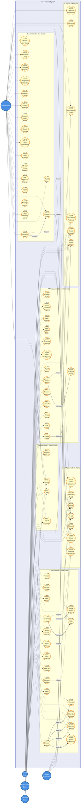

# MyFoodshare Use Case Diagram

## System Use Case Diagram (Comprehensive Layout)

```mermaid
graph LR
    %% Left Side Actors
    Guest((Guest<br/>User))
    Restaurant((Restaurant<br/>Donor))
    Recipient((Recipient<br/>NGO))

    %% Right Side Actors
    Admin((Administrator))
    SystemAuto((System<br/>Automated))

    subgraph System[" MyFoodshare System "]
        direction TB

        subgraph Auth["🔐 Authentication & Authorization"]
            direction TB
            UC1((UC1<br/>Register<br/>Account))
            UC2((UC2<br/>Login))
            UC3((UC3<br/>Logout))
            UC4((UC4<br/>Reset<br/>Password))
        end

        subgraph RestUC["🍽️ Restaurant/Donor Use Cases"]
            direction TB
            UC5((UC5<br/>Create<br/>Listing))
            UC6((UC6<br/>Edit<br/>Listing))
            UC7((UC7<br/>Delete<br/>Listing))
            UC8((UC8<br/>View My<br/>Listings))
            UC9((UC9<br/>Review<br/>Matches))
            UC10((UC10<br/>Approve<br/>Match))
            UC11((UC11<br/>Reject<br/>Match))
            UC12((UC12<br/>Schedule<br/>Pickup))
            UC13((UC13<br/>View<br/>Verifications))
            UC14((UC14<br/>Generate<br/>QR Code))
            UC15((UC15<br/>View<br/>Impact<br/>Stats))
            UC16((UC16<br/>View<br/>Reports))
            UC17((UC17<br/>Track<br/>Donation<br/>Progress))
            UC18((UC18<br/>Manage<br/>Profile))
        end

        subgraph RecipUC["🎯 Recipient/NGO Use Cases"]
            direction TB
            UC19((UC19<br/>Browse<br/>Listings))
            UC20((UC20<br/>Search<br/>by Keyword))
            UC21((UC21<br/>Filter by<br/>Category))
            UC22((UC22<br/>Filter by<br/>Distance))
            UC23((UC23<br/>View on<br/>Map))
            UC24((UC24<br/>View<br/>Details))
            UC25((UC25<br/>Express<br/>Interest))
            UC26((UC26<br/>View My<br/>Matches))
            UC27((UC27<br/>View<br/>Schedule))
            UC28((UC28<br/>Scan<br/>QR Code))
            UC29((UC29<br/>Verify<br/>Pickup<br/>Manually))
            UC30((UC30<br/>Complete<br/>Pickup))
            UC31((UC31<br/>Rate<br/>Quality))
            UC32((UC32<br/>Upload<br/>Photo<br/>Evidence))
            UC33((UC33<br/>View<br/>History))
            UC34((UC34<br/>Manage<br/>Profile))
            UC35((UC35<br/>Cancel<br/>Match))
        end

        subgraph AdminUC["⚙️ Administrator Use Cases"]
            direction TB
            UC36((UC36<br/>Approve<br/>User))
            UC37((UC37<br/>Reject<br/>User))
            UC38((UC38<br/>View<br/>Pending<br/>Users))
            UC39((UC39<br/>Manage<br/>Users))
            UC40((UC40<br/>Approve<br/>Listing))
            UC41((UC41<br/>Reject<br/>Listing))
            UC42((UC42<br/>Bulk<br/>Approve<br/>Listings))
            UC43((UC43<br/>Monitor<br/>Active<br/>Listings))
            UC44((UC44<br/>View<br/>Matches))
            UC45((UC45<br/>View<br/>Verifications))
            UC46((UC46<br/>Handle<br/>Disputes))
            UC47((UC47<br/>Resolve<br/>Quality<br/>Issues))
            UC48((UC48<br/>System<br/>Analytics))
            UC49((UC49<br/>Monthly<br/>Trends))
            UC50((UC50<br/>Geographic<br/>Distribution))
            UC51((UC51<br/>Generate<br/>Reports))
            UC52((UC52<br/>Deactivate<br/>Listing))
            UC53((UC53<br/>Update<br/>User Status))
        end

        subgraph NotifyUC["🔔 Notifications & Real-time"]
            direction TB
            UC54((UC54<br/>Email<br/>Notify))
            UC55((UC55<br/>In-App<br/>Notify))
            UC56((UC56<br/>Push<br/>Notify))
            UC57((UC57<br/>View<br/>Notifications))
            UC58((UC58<br/>Mark as<br/>Read))
            UC59((UC59<br/>Delete<br/>Notification))
            UC60((UC60<br/>Real-time<br/>Broadcast))
        end

        subgraph StatsUC["📊 Impact & Analytics"]
            direction TB
            UC61((UC61<br/>Dashboard<br/>Stats))
            UC62((UC62<br/>Activity<br/>Logs))
            UC63((UC63<br/>Meals<br/>Provided))
            UC64((UC64<br/>Food Waste<br/>Reduced))
            UC65((UC65<br/>Success<br/>Rate))
            UC66((UC66<br/>Category<br/>Breakdown))
        end
    end

    %% Guest Relationships
    Guest -.-> UC1
    Guest -.-> UC2

    %% Restaurant Relationships
    Restaurant -.-> UC2
    Restaurant -.-> UC3
    Restaurant -.-> UC4
    Restaurant -.-> UC5
    Restaurant -.-> UC6
    Restaurant -.-> UC7
    Restaurant -.-> UC8
    Restaurant -.-> UC9
    Restaurant -.-> UC10
    Restaurant -.-> UC11
    Restaurant -.-> UC12
    Restaurant -.-> UC13
    Restaurant -.-> UC14
    Restaurant -.-> UC15
    Restaurant -.-> UC16
    Restaurant -.-> UC17
    Restaurant -.-> UC18
    Restaurant -.-> UC55
    Restaurant -.-> UC56
    Restaurant -.-> UC57
    Restaurant -.-> UC58
    Restaurant -.-> UC61
    Restaurant -.-> UC62
    Restaurant -.-> UC63
    Restaurant -.-> UC64

    %% Recipient Relationships
    Recipient -.-> UC2
    Recipient -.-> UC3
    Recipient -.-> UC4
    Recipient -.-> UC19
    Recipient -.-> UC20
    Recipient -.-> UC21
    Recipient -.-> UC22
    Recipient -.-> UC23
    Recipient -.-> UC24
    Recipient -.-> UC25
    Recipient -.-> UC26
    Recipient -.-> UC27
    Recipient -.-> UC28
    Recipient -.-> UC29
    Recipient -.-> UC30
    Recipient -.-> UC31
    Recipient -.-> UC32
    Recipient -.-> UC33
    Recipient -.-> UC34
    Recipient -.-> UC35
    Recipient -.-> UC55
    Recipient -.-> UC56
    Recipient -.-> UC57
    Recipient -.-> UC58
    Recipient -.-> UC61
    Recipient -.-> UC63

    %% Admin Relationships
    Admin -.-> UC2
    Admin -.-> UC3
    Admin -.-> UC36
    Admin -.-> UC37
    Admin -.-> UC38
    Admin -.-> UC39
    Admin -.-> UC40
    Admin -.-> UC41
    Admin -.-> UC42
    Admin -.-> UC43
    Admin -.-> UC44
    Admin -.-> UC45
    Admin -.-> UC46
    Admin -.-> UC47
    Admin -.-> UC48
    Admin -.-> UC49
    Admin -.-> UC50
    Admin -.-> UC51
    Admin -.-> UC52
    Admin -.-> UC53
    Admin -.-> UC55
    Admin -.-> UC57
    Admin -.-> UC61
    Admin -.-> UC62
    Admin -.-> UC65
    Admin -.-> UC66

    %% System Automated
    SystemAuto -.-> UC54
    SystemAuto -.-> UC55
    SystemAuto -.-> UC56
    SystemAuto -.-> UC60
    SystemAuto -.-> UC62
    SystemAuto -.-> UC63
    SystemAuto -.-> UC64

    %% Dependencies - includes
    UC5 -->|includes| UC62
    UC10 -->|includes| UC12
    UC30 -->|includes| UC31
    UC30 -->|includes| UC32
    UC36 -->|includes| UC40
    UC40 -->|triggers| UC60

    %% Dependencies - extends
    UC19 -->|extends| UC20
    UC19 -->|extends| UC21
    UC19 -->|extends| UC22
    UC19 -->|extends| UC23

    %% Notification Triggers
    UC10 -.->|triggers| UC55
    UC25 -.->|triggers| UC55
    UC36 -.->|triggers| UC54
    UC37 -.->|triggers| UC54
    UC28 -.->|triggers| UC60
    UC30 -.->|triggers| UC60

    %% Styling
    classDef actorStyle fill:#4A90E2,stroke:#2E5C8A,stroke-width:3px,color:#fff
    classDef useCaseStyle fill:#FFF9C4,stroke:#F57F17,stroke-width:2px
    classDef systemBg fill:#E8EAF6,stroke:#3F51B5,stroke-width:2px

    class Guest,Restaurant,Recipient,Admin,SystemAuto actorStyle
    class UC1,UC2,UC3,UC4,UC5,UC6,UC7,UC8,UC9,UC10,UC11,UC12,UC13,UC14,UC15,UC16,UC17,UC18,UC19,UC20,UC21,UC22,UC23,UC24,UC25,UC26,UC27,UC28,UC29,UC30,UC31,UC32,UC33,UC34,UC35,UC36,UC37,UC38,UC39,UC40,UC41,UC42,UC43,UC44,UC45,UC46,UC47,UC48,UC49,UC50,UC51,UC52,UC53,UC54,UC55,UC56,UC57,UC58,UC59,UC60,UC61,UC62,UC63,UC64,UC65,UC66 useCaseStyle
    class System systemBg
```

## Detailed Use Case Descriptions

### 1. Authentication & Authorization

| Use Case ID | Use Case Name | Actor | Description | Routes |
|------------|---------------|-------|-------------|---------|
| UC1 | Register Account | Guest User | User registers as Restaurant/Donor or Recipient/NGO with role-specific details including GPS coordinates | GET/POST /register/donor GET/POST /register/recipient |
| UC2 | Login | All Users | User authenticates with email and password, role-based redirect to dashboard | POST /login |
| UC3 | Logout | All Authenticated Users | User logs out of the system, session terminated | POST /logout |
| UC4 | Reset Password | All Users | User requests password reset via email | N/A (Not implemented) |

### 2. Restaurant/Donor Use Cases

| Use Case ID | Use Case Name | Actor | Description | Routes |
|------------|---------------|-------|-------------|---------|
| UC5 | Create Food Listing | Restaurant | Create new food donation listing with details (food name, category, quantity, expiry, GPS coordinates, photos, dietary info) | GET/POST /restaurant/listings/create |
| UC6 | Edit Food Listing | Restaurant | Modify existing food listing details | GET/PUT /restaurant/listings/{id}/edit |
| UC7 | Delete Food Listing | Restaurant | Remove food listing from system | DELETE /restaurant/listings/{id} |
| UC8 | View My Listings | Restaurant | View all owned food listings with status | GET /restaurant/listings |
| UC9 | Review Match Requests | Restaurant | View recipient interest/matches for listings | GET /restaurant/matches |
| UC10 | Approve Match | Restaurant | Accept recipient's interest and approve match | PATCH /restaurant/listings/{id}/matches/{match}/approve |
| UC11 | Reject Match | Restaurant | Decline recipient's interest | PATCH /restaurant/listings/{id}/matches/{match}/reject |
| UC12 | Schedule Pickup Time | Restaurant | Set pickup date and time for approved match, creates PickupVerification record | PATCH /restaurant/listings/{id}/matches/{match}/schedule |
| UC13 | View Pickup Verifications | Restaurant | Monitor pickup verification status, QR scanning, completion | GET /restaurant/matches |
| UC14 | Generate QR Code | Restaurant | Create QR code containing verification URL for pickup | POST /api/restaurant/listings/{listing}/generate-qr |
| UC15 | View Impact Statistics | Restaurant | View meals provided, food waste reduced, monthly trends | GET /restaurant/dashboard |
| UC16 | View Donation Reports | Restaurant | Access detailed donation history reports with filters | GET /restaurant/reports |
| UC17 | Track Donation Progress | Restaurant | Monitor status of active donations and pickups | GET /restaurant/track-donations |
| UC18 | Manage Profile | Restaurant | Update restaurant information, GPS coordinates, business details | GET/PUT /restaurant/profile |

### 3. Recipient/NGO Use Cases

| Use Case ID | Use Case Name | Actor | Description | Routes |
|------------|---------------|-------|-------------|---------|
| UC19 | Browse Food Listings | Recipient | View available food listings filtered by distance (default 5km radius using Haversine formula) | GET /recipient/browse |
| UC20 | Search by Keyword | Recipient | Search listings by food name or description | GET /recipient/browse?search=keyword |
| UC21 | Filter by Category | Recipient | Filter listings by food category | GET /recipient/browse?category=X |
| UC22 | Filter by Distance | Recipient | Filter listings by distance radius from recipient location | GET /recipient/browse?radius=X |
| UC23 | View on Map | Recipient | See listings plotted on map with GPS coordinates | GET /recipient/browse/map |
| UC24 | View Listing Details | Recipient | See complete food listing information with distance, expiry, photos | GET /recipient/browse/{listing} |
| UC25 | Express Interest | Recipient | Show interest in a food listing, creates FoodMatch record with pending status | POST /recipient/browse/{listing}/interest |
| UC26 | View My Matches | Recipient | View all matched food donations with statuses | GET /recipient/matches |
| UC27 | View Pickup Schedule | Recipient | Check scheduled pickup times and verification codes | GET /recipient/matches |
| UC28 | Scan QR Code | Recipient | Scan QR code at pickup location using device camera | GET /pickup/scanner |
| UC29 | Verify Pickup Manually | Recipient | Verify pickup with verification code without scanning | GET/POST /pickup/verify/{code} POST /api/pickup/scan/{code} |
| UC30 | Complete Pickup | Recipient | Confirm food received, submit completion form | POST /api/pickup/complete/{code} PATCH /recipient/matches/{match}/complete |
| UC31 | Rate Food Quality | Recipient | Provide quality rating (1-5 stars) and quality_confirmed flag | Included in UC30 |
| UC32 | Upload Photo Evidence | Recipient | Upload photo evidence of received food (stored as JSON array) | Included in UC30 |
| UC33 | View History | Recipient | View history of received donations with ratings | GET /recipient/matches |
| UC34 | Manage Profile | Recipient | Update organization information, GPS coordinates, capacity | GET/PUT /recipient/profile |
| UC35 | Cancel Match | Recipient | Withdraw from unscheduled match | PATCH /recipient/matches/{match}/cancel |

### 4. Admin Use Cases

| Use Case ID | Use Case Name | Actor | Description | Routes |
|------------|---------------|-------|-------------|---------|
| UC36 | Approve User Registration | Admin | Approve pending user registrations, sets status to 'active', records approved_by and approved_at | PATCH /admin/pending-approvals/{user}/approve |
| UC37 | Reject User Registration | Admin | Reject pending user registrations, sets status to 'rejected', adds admin_notes | PATCH /admin/pending-approvals/{user}/reject |
| UC38 | View Pending Users | Admin | View list of users awaiting approval with application details | GET /admin/pending-approvals |
| UC39 | Manage Users | Admin | Edit, search, filter users by role/status, suspend/activate accounts | GET /admin/users PATCH /admin/users/{user}/status |
| UC40 | Approve Listing | Admin | Approve food listing, triggers auto-matching with nearby recipients (5km), sets approval_status to 'approved' | PATCH /admin/listing-approvals/{listing}/approve |
| UC41 | Reject Listing | Admin | Reject food listing with reason | PATCH /admin/listing-approvals/{listing}/reject |
| UC42 | Bulk Approve Listings | Admin | Approve multiple listings at once | POST /admin/listing-approvals/bulk-approve |
| UC43 | Monitor Active Listings | Admin | View and monitor all active food listings | GET /admin/active-listings |
| UC44 | View Matches | Admin | Track all food matches across platform | GET /admin/matches (implied) |
| UC45 | View Verifications | Admin | Monitor all pickup verifications with statuses | GET /admin/pickup-verifications |
| UC46 | Handle Disputes | Admin | Review and resolve quality disputes from pickups | GET /admin/pickup-verifications/{verification} |
| UC47 | Resolve Quality Issues | Admin | Investigate quality_confirmed=false cases, add resolution notes | POST /admin/pickup-verifications/{verification}/resolve |
| UC48 | System Analytics | Admin | View platform-wide statistics (users, listings, matches, success rate) | GET /admin/analytics |
| UC49 | Monthly Trends | Admin | Analyze monthly system trends (6-12 months data) | GET /admin/analytics |
| UC50 | Geographic Distribution | Admin | See regional activity distribution on map | GET /admin/analytics |
| UC51 | Generate Reports | Admin | Create system reports for compliance and analysis | GET /admin/analytics (export functionality) |
| UC52 | Deactivate Listing | Admin | Manually deactivate or mark listing as expired | PATCH /admin/active-listings/{listing}/deactivate PATCH /admin/active-listings/{listing}/expire |
| UC53 | Update User Status | Admin | Change user status (active/suspended/rejected) | PATCH /admin/users/{user}/status |

### 5. Notification Use Cases

| Use Case ID | Use Case Name | Actor | Description | Technology |
|------------|---------------|-------|-------------|------------|
| UC54 | Receive Email Notifications | All Users | Get email notifications for registration approval/rejection | Laravel Mail |
| UC55 | Receive In-App Notifications | All Authenticated Users | View in-app notifications for matches, pickups, completions | Laravel Notifications |
| UC56 | Receive Push Notifications | Restaurant, Recipient | Get mobile push notifications via FCM token | Firebase Cloud Messaging (optional) |
| UC57 | View Notification History | All Authenticated Users | Access past notifications with pagination | GET /notifications |
| UC58 | Mark as Read | All Authenticated Users | Mark notification as read, sets read_at timestamp | POST /notifications/{id}/read POST /notifications/mark-all-read |
| UC59 | Delete Notification | All Authenticated Users | Remove notification from history | DELETE /notifications/{id} |
| UC60 | Real-time Broadcast | System | Broadcast events via Pusher WebSockets (QR scanned, pickup completed, match updates) | Pusher + Laravel Echo |

### 6. Impact & Analytics Use Cases

| Use Case ID | Use Case Name | Actor | Description | Data Source |
|------------|---------------|-------|-------------|-------------|
| UC61 | Dashboard Statistics | Restaurant, Recipient, Admin | View role-specific statistics (own stats for restaurant/recipient, system-wide for admin) | GET /restaurant/dashboard GET /recipient/dashboard GET /admin/dashboard |
| UC62 | Activity Logs | Restaurant, Admin | View system activity logs with polymorphic subject/causer relationships | activity_logs table |
| UC63 | Meals Provided | Restaurant, Recipient, System | Calculate and display total meals provided from completed pickups | ActivityLog::calculateMealsProvided() |
| UC64 | Food Waste Reduced | Restaurant, System | Calculate and display food waste reduced in kg | ActivityLog::calculateFoodWasteReduced() |
| UC65 | Success Rate | Admin | Calculate percentage of successful pickups vs total matches | Admin analytics |
| UC66 | Category Breakdown | Admin | View distribution of food by category | Admin analytics |

## Use Case Relationships

### Include Relationships
- **Create Food Listing (UC5)** includes **Activity Logs (UC62)** - Automatically logs listing creation with estimated meals and weight
- **Approve Match (UC10)** includes **Schedule Pickup Time (UC12)** - Must schedule pickup after approval, creates PickupVerification record
- **Complete Pickup (UC30)** includes **Rate Food Quality (UC31)** - Quality rating (1-5 stars) is required for completion
- **Complete Pickup (UC30)** includes **Upload Photo Evidence (UC32)** - Photo evidence can be uploaded during completion
- **Approve User (UC36)** includes **Approve Listing (UC40)** - Admin approval workflow for both users and listings

### Extend Relationships
- **Browse Food Listings (UC19)** extends to **Search by Keyword (UC20)** - Optional search functionality
- **Browse Food Listings (UC19)** extends to **Filter by Category (UC21)** - Optional category filtering
- **Browse Food Listings (UC19)** extends to **Filter by Distance (UC22)** - Optional distance radius filtering
- **Browse Food Listings (UC19)** extends to **View on Map (UC23)** - Optional map view with GPS plotting

### Triggers (Notifications & Real-time Events)
- **Approve Match (UC10)** triggers **Receive In-App Notifications (UC55)** - PickupConfirmedNotification sent to recipient
- **Express Interest (UC25)** triggers **Receive In-App Notifications (UC55)** - InterestExpressedNotification sent to restaurant
- **Approve User (UC36)** triggers **Receive Email Notifications (UC54)** - Account activation email
- **Reject User (UC37)** triggers **Receive Email Notifications (UC54)** - Account rejection email
- **Scan QR Code (UC28)** triggers **Real-time Broadcast (UC60)** - QrCodeScanned event broadcast to restaurant
- **Complete Pickup (UC30)** triggers **Real-time Broadcast (UC60)** - PickupCompleted event broadcast with quality rating
- **Approve Listing (UC40)** triggers **Real-time Broadcast (UC60)** - NewFoodMatchNotification broadcast to nearby recipients

## Actor Descriptions

| Actor | Description | Responsibilities | Middleware |
|-------|-------------|------------------|------------|
| **Guest User** | Unauthenticated visitor | Can register and login only | guest |
| **Restaurant/Donor** | Food provider (restaurants, cafes, food businesses) | Create and manage food listings, approve matches, manage pickups, generate QR codes, view impact metrics | auth, restaurant_owner |
| **Recipient/NGO** | Food recipient (NGOs, charities, community organizations) | Browse listings (distance-filtered), express interest, scan QR codes, complete pickups, rate quality | auth, recipient |
| **Administrator** | System admin | Manage users (approve/reject registrations), approve listings (triggers auto-matching), monitor system, resolve disputes, view analytics | auth, admin |
| **System Automated** | Automated processes | Send notifications, broadcast real-time events, calculate statistics, log activities, auto-match listings with recipients | N/A |

## Business Rules

1. **User Registration Approval**: All new users (donors and recipients) start with status 'pending' and require admin approval before accessing the system. Status must be 'active' to login.

2. **Food Listing Approval**: All food listings require admin approval before becoming visible to recipients. approval_status must be 'approved'.

3. **GPS-Based Matching**: When admin approves a listing, FoodMatchingService automatically creates matches with recipients within 5km radius using Haversine formula. Falls back to all recipients if GPS coordinates are missing.

4. **Match Approval**: Only the restaurant owner can approve/reject match requests. Approval triggers pickup scheduling and PickupVerification creation.

5. **Pickup Verification**: Requires valid verification code in format VRF-XXXXXXXX. QR code contains URL to /pickup/verify/{code}.

6. **Quality Rating Requirement**: Recipients must provide quality rating (1-5 stars) when completing pickup. quality_confirmed boolean indicates satisfaction.

7. **Photo Evidence**: Optional photo upload during pickup completion, stored as JSON array in photo_evidence field.

8. **Listing Expiry**: Food listings automatically expire after expiry_date and expiry_time. Expired listings not visible to recipients.

9. **Match Limit**: Recipients can only express interest once per listing (creates or updates existing FoodMatch record).

10. **Pickup Completion**: Only recipients who verified pickup (qr_code_scanned=true or manual verification) can complete it.

11. **Activity Logging**: All major actions logged in activity_logs table with polymorphic subject/causer relationships for audit trail.

12. **Real-time Notifications**: Events broadcast via Pusher to private channels (private-user-{id}, private-restaurant-{id}, private-recipient-{id}).

13. **Distance Calculation**: System uses Haversine formula with Earth radius 6371 km to calculate geographic distances between GPS coordinates.

14. **Impact Metrics**: Meals provided and food waste reduced calculated from activity_logs where log_name='pickup' and description='pickup_completed'.

## System Boundaries

**Included in System:**
- User management with three-tier approval (admin approves users, admin approves listings, recipients verify pickups)
- Food listing management with approval workflow and GPS coordinates
- GPS-based matching and distance filtering (Haversine formula, 5km default radius)
- Pickup verification with QR codes (VRF-XXXXXXXX format) and manual verification
- Real-time notifications via Pusher/Laravel Echo (WebSockets)
- In-app notifications (Laravel Notifications stored in database)
- Email notifications (registration approval/rejection)
- Activity logging with polymorphic relationships (audit trail)
- Impact analytics and reporting (meals provided, waste reduced, success rate)
- Quality rating system (1-5 stars) with photo evidence
- Map view for browsing listings (GPS-based plotting)
- Admin oversight and dispute resolution
- Role-based access control with middleware (admin, restaurant_owner, recipient)

**Excluded from System:**
- Payment processing (all donations are free)
- Food delivery services (pickup only, self-service)
- Inventory management for restaurants
- Tax/accounting features
- Social media integration
- Native mobile apps (responsive web application only)
- SMS notifications (only email, in-app, and optional push via FCM)
- Multi-language support (English only)
- Automated listing expiry notifications (manual monitoring by admin)

## Key Technologies

### Backend
- **Framework**: Laravel 10.10, PHP 8.1+
- **Database**: MySQL
- **Authentication**: Laravel Sanctum (API tokens)
- **QR Code**: SimpleSoftwareIO QR Code generation
- **Broadcasting**: Pusher (WebSocket service)
- **Notifications**: Laravel Notification system

### Frontend
- **Framework**: React 18.2 with TypeScript
- **Routing**: React Router
- **Build Tool**: Vite
- **Styling**: Tailwind CSS + PostCSS
- **Charts**: Recharts for data visualization
- **Icons**: Lucide React
- **Real-time**: Laravel Echo client

### Real-time Communication
- **WebSocket**: Pusher service
- **Client**: Laravel Echo
- **Channels**: Private user channels (private-user-{id}, private-restaurant-{id}, private-recipient-{id})
- **Events**: MatchStatusUpdated, QrCodeScanned, PickupCompleted

## Database Schema Overview

### Key Tables
- **users**: All user accounts with role field (restaurant/recipient/admin), status field (pending/active/suspended/rejected), GPS coordinates (latitude, longitude), approval tracking (approved_at, approved_by, admin_notes)
- **food_listings**: Food donations with approval_status (pending_approval/approved/rejected), GPS coordinates, expiry_date/time, images (JSON array), dietary_info (JSON), approved_by foreign key
- **food_matches**: Donor-recipient pairings with status (pending/approved/scheduled/completed/rejected/cancelled), distance (calculated), timestamps (matched_at, approved_at, pickup_scheduled_at, completed_at), qr_code
- **pickup_verifications**: QR verification records with verification_code (unique VRF-XXXXXXXX), qr_code_scanned (boolean), verification_status (pending/verified/completed), quality_rating (1-5), quality_confirmed (boolean), photo_evidence (JSON array), pickup_details (JSON), location_data (JSON)
- **activity_logs**: Comprehensive audit trail with log_name (donation/pickup/admin), polymorphic subject (subject_type, subject_id), polymorphic causer (causer_type, causer_id), properties (JSON), batch_uuid
- **notifications**: Laravel notifications with polymorphic notifiable (notifiable_type, notifiable_id), type (notification class), data (JSON), read_at timestamp
- **tracking**: Historical status changes for matches (match_id, status, notes, status_changed_at, location_data)

### Important Fields
- **GPS Coordinates**: latitude, longitude stored on users and food_listings tables for distance calculations
- **Status Tracking**: status, approval_status, verification_status for workflow management
- **JSON Fields**: dietary_info, images, qr_code_data, location_data, photo_evidence, pickup_details for flexible data storage
- **Timestamps**: expiry tracking (expiry_date, expiry_time), approval tracking (approved_at, approved_by), completion tracking (pickup_completed_at, scanned_at)
- **Polymorphic Relationships**: subject_type/id, causer_type/id, notifiable_type/id for flexible associations

## Use Case Prioritization

### High Priority (Core Functionality)
- UC1, UC2, UC3: Authentication flow
- UC5, UC8, UC10, UC12: Donor workflow
- UC19, UC24, UC25, UC30: Recipient workflow
- UC36, UC40: Admin approval workflow
- UC28, UC29, UC31: Pickup verification
- UC55, UC60: Real-time notifications
- UC63, UC64: Impact metrics

### Medium Priority (Enhanced Features)
- UC14: QR code generation
- UC15, UC16, UC17: Reports and analytics
- UC20, UC21, UC22, UC23: Advanced browsing
- UC32: Photo evidence
- UC48, UC49, UC50: Admin analytics
- UC62: Activity logging

### Low Priority (Nice-to-Have)
- UC4: Password reset
- UC6, UC7: Listing management
- UC35: Match cancellation
- UC46, UC47: Dispute resolution
- UC51: Report export
- UC52, UC53: Advanced admin actions
- UC56: Push notifications (optional)
- UC59: Delete notifications
