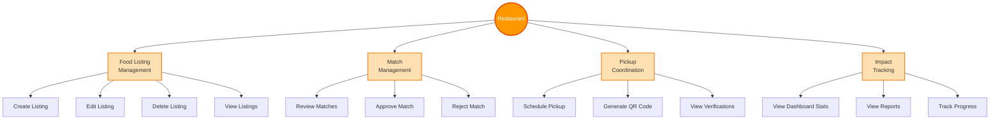
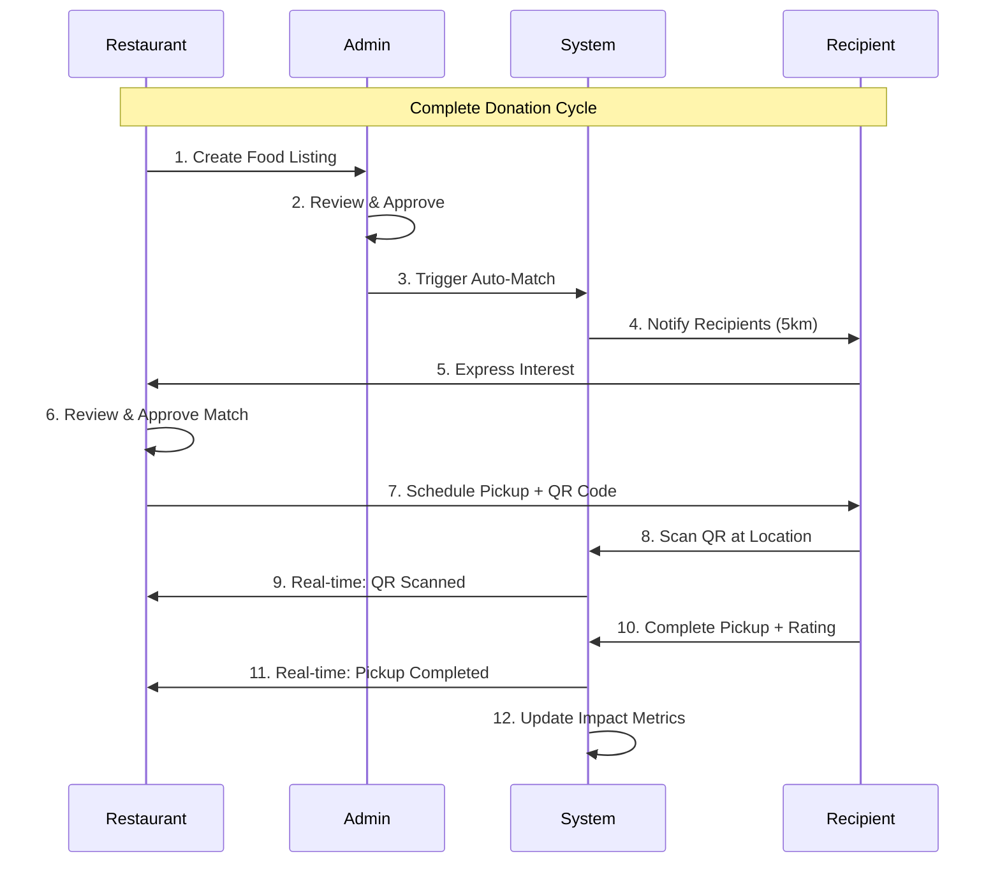

# MyFoodshare Use Case Diagram (Simplified)

## High-Level System Overview

```mermaid
graph TD
    %% Actors
    Guest((Guest))
    Restaurant((Restaurant<br/>Donor))
    Recipient((Recipient<br/>NGO))
    Admin((Admin))
    System((System))

    subgraph MyFoodshare[" MyFoodshare Platform "]
        direction TB

        subgraph CoreAuth["🔐 Authentication"]
            Auth[Register & Login]
        end

        subgraph CoreDonor["🍽️ Restaurant Functions"]
            ManageList[Manage Food<br/>Listings]
            ManageMatch[Manage<br/>Matches]
            GenQR[Generate QR<br/>& Schedule]
            ViewImpact[View Impact<br/>& Reports]
        end

        subgraph CoreRecip["🎯 Recipient Functions"]
            Browse[Browse &<br/>Search Food]
            ExpressInt[Express<br/>Interest]
            VerifyPick[Verify &<br/>Complete Pickup]
            ViewHist[View History<br/>& Stats]
        end

        subgraph CoreAdmin["⚙️ Admin Functions"]
            ApproveUsers[Approve<br/>Users]
            ApproveLists[Approve<br/>Listings]
            Monitor[Monitor<br/>System]
            Analytics[View<br/>Analytics]
        end

        subgraph AutoSys["🔄 Automated"]
            AutoMatch[Auto-Match<br/>5km Radius]
            Notify[Send<br/>Notifications]
            LogTrack[Activity<br/>Logging]
        end
    end

    %% Connections
    Guest --> Auth
    Restaurant --> Auth
    Recipient --> Auth
    Admin --> Auth

    Restaurant --> ManageList
    Restaurant --> ManageMatch
    Restaurant --> GenQR
    Restaurant --> ViewImpact

    Recipient --> Browse
    Recipient --> ExpressInt
    Recipient --> VerifyPick
    Recipient --> ViewHist

    Admin --> ApproveUsers
    Admin --> ApproveLists
    Admin --> Monitor
    Admin --> Analytics

    System --> AutoMatch
    System --> Notify
    System --> LogTrack

    %% Triggers (dotted lines)
    ApproveLists -.triggers.-> AutoMatch
    ManageMatch -.triggers.-> Notify
    ExpressInt -.triggers.-> Notify
    VerifyPick -.triggers.-> Notify
    VerifyPick -.triggers.-> LogTrack

    %% Styling
    classDef actorStyle fill:#4A90E2,stroke:#2E5C8A,stroke-width:3px,color:#fff
    classDef coreStyle fill:#FFF9C4,stroke:#F57F17,stroke-width:2px
    classDef autoStyle fill:#E0E0E0,stroke:#616161,stroke-width:2px

    class Guest,Restaurant,Recipient,Admin,System actorStyle
    class Auth,ManageList,ManageMatch,GenQR,ViewImpact,Browse,ExpressInt,VerifyPick,ViewHist,ApproveUsers,ApproveLists,Monitor,Analytics coreStyle
    class AutoMatch,Notify,LogTrack autoStyle
```

---

## Use Cases by Actor (Vertical Layout)

### 🍽️ Restaurant/Donor (13 Use Cases)

**Breakdown:**
- **Food Listing Management (4)**: Create, Edit, Delete, View
- **Match Management (3)**: Review, Approve, Reject
- **Pickup Coordination (3)**: Schedule, Generate QR, View Verifications
- **Impact Tracking (3)**: Dashboard, Reports, Progress

---

### 🎯 Recipient/NGO (14 Use Cases)

```mermaid
graph TD
    Recipient((Recipient))

    Recipient --> Group1[Food<br/>Discovery]
    Recipient --> Group2[Match<br/>Actions]
    Recipient --> Group3[Pickup<br/>Process]
    Recipient --> Group4[History &<br/>Stats]

    Group1 --> UC1A[Browse Listings]
    Group1 --> UC1B[Search by Keyword]
    Group1 --> UC1C[Filter by Category]
    Group1 --> UC1D[Filter by Distance]
    Group1 --> UC1E[View on Map]

    Group2 --> UC2A[Express Interest]
    Group2 --> UC2B[View My Matches]
    Group2 --> UC2C[Cancel Match]

    Group3 --> UC3A[Scan QR Code]
    Group3 --> UC3B[Verify Manually]
    Group3 --> UC3C[Complete Pickup]
    Group3 --> UC3D[Rate Quality]
    Group3 --> UC3E[Upload Photos]

    Group4 --> UC4A[View History]
    Group4 --> UC4B[View Dashboard]

    style Recipient fill:#2196F3,stroke:#0D47A1,stroke-width:3px,color:#fff
    style Group1 fill:#BBDEFB,stroke:#1976D2,stroke-width:2px
    style Group2 fill:#BBDEFB,stroke:#1976D2,stroke-width:2px
    style Group3 fill:#BBDEFB,stroke:#1976D2,stroke-width:2px
    style Group4 fill:#BBDEFB,stroke:#1976D2,stroke-width:2px
```

**Breakdown:**
- **Food Discovery (5)**: Browse, Search, Filter by Category/Distance, Map View
- **Match Actions (3)**: Express Interest, View Matches, Cancel
- **Pickup Process (5)**: Scan QR, Verify Manually, Complete, Rate, Upload Photos
- **History & Stats (2)**: View History, Dashboard

---

### ⚙️ Admin (19 Use Cases)

```mermaid
graph TD
    Admin((Admin))

    Admin --> Group1[User<br/>Management]
    Admin --> Group2[Listing<br/>Management]
    Admin --> Group3[System<br/>Monitoring]
    Admin --> Group4[Dispute<br/>Resolution]
    Admin --> Group5[Analytics &<br/>Reporting]

    Group1 --> UC1A[View Pending Users]
    Group1 --> UC1B[Approve User]
    Group1 --> UC1C[Reject User]
    Group1 --> UC1D[Manage Users]
    Group1 --> UC1E[Update Status]

    Group2 --> UC2A[View Pending Listings]
    Group2 --> UC2B[Approve Listing]
    Group2 --> UC2C[Reject Listing]
    Group2 --> UC2D[Bulk Approve]
    Group2 --> UC2E[Deactivate Listing]

    Group3 --> UC3A[Monitor Active Listings]
    Group3 --> UC3B[View All Matches]
    Group3 --> UC3C[View Verifications]

    Group4 --> UC4A[Handle Disputes]
    Group4 --> UC4B[Resolve Quality Issues]

    Group5 --> UC5A[System Analytics]
    Group5 --> UC5B[Monthly Trends]
    Group5 --> UC5C[Geographic Distribution]
    Group5 --> UC5D[Generate Reports]

    style Admin fill:#9C27B0,stroke:#4A148C,stroke-width:3px,color:#fff
    style Group1 fill:#E1BEE7,stroke:#7B1FA2,stroke-width:2px
    style Group2 fill:#E1BEE7,stroke:#7B1FA2,stroke-width:2px
    style Group3 fill:#E1BEE7,stroke:#7B1FA2,stroke-width:2px
    style Group4 fill:#E1BEE7,stroke:#7B1FA2,stroke-width:2px
    style Group5 fill:#E1BEE7,stroke:#7B1FA2,stroke-width:2px
```

**Breakdown:**
- **User Management (5)**: View Pending, Approve, Reject, Manage, Update Status
- **Listing Management (5)**: View Pending, Approve, Reject, Bulk Approve, Deactivate
- **System Monitoring (3)**: Monitor Listings, View Matches, View Verifications
- **Dispute Resolution (2)**: Handle Disputes, Resolve Quality Issues
- **Analytics & Reporting (4)**: System Analytics, Trends, Geographic Data, Reports

---

## Core User Journey (Sequence Diagram)

---

## Summary Statistics

### Use Case Count
- **Restaurant/Donor**: 13 use cases
- **Recipient/NGO**: 14 use cases
- **Admin**: 19 use cases
- **System Automated**: 3 core functions
- **Shared (Authentication)**: 3 use cases

**Total: 52 Use Cases** (reduced from 66)

### Grouped Functions
- **4 Core Functions per Restaurant** (Listing, Match, Pickup, Impact)
- **4 Core Functions per Recipient** (Discovery, Match, Pickup, History)
- **5 Core Functions per Admin** (Users, Listings, Monitoring, Disputes, Analytics)
- **3 Automated Functions** (Auto-Match, Notifications, Logging)

---

## Actor Summary

| Actor | Primary Responsibilities | Core Functions |
|-------|-------------------------|----------------|
| **Guest** | Registration and Login | 2 use cases |
| **Restaurant/Donor** | Create listings, manage matches, coordinate pickups, track impact | 13 use cases |
| **Recipient/NGO** | Browse food, express interest, complete pickups, view history | 14 use cases |
| **Admin** | Approve users/listings, monitor system, resolve disputes, analytics | 19 use cases |
| **System** | Auto-match recipients, send notifications, log activities | 3 functions |

---

## Business Rules

1. **User Approval**: All users require admin approval before access
2. **Listing Approval**: All listings require admin approval before visibility
3. **GPS Matching**: Auto-match recipients within 5km radius using Haversine formula
4. **QR Verification**: Unique verification codes (VRF-XXXXXXXX) for secure pickup
5. **Quality Rating**: Required 1-5 star rating on pickup completion
6. **Real-time Updates**: Pusher WebSocket notifications for all key events
7. **Activity Logging**: All actions logged for audit trail and impact metrics
8. **Status Tracking**: Multi-status workflow (pending → approved → scheduled → completed)

---

## Color Legend

- **🟠 Orange**: Restaurant/Donor actions and interfaces
- **🔵 Blue**: Recipient/NGO actions and interfaces
- **🟣 Purple**: Admin actions and interfaces
- **⚪ Gray**: Automated system processes
- **🟡 Yellow**: Shared/Authentication features

---

## Notes

This simplified diagram consolidates 66 detailed use cases into:
- **13 high-level functional groups**
- **4 core functions per actor**
- **Clear vertical hierarchy**
- **Easy-to-understand sequence flows**

For detailed use case specifications, see [USE_CASE_DIAGRAM.md](USE_CASE_DIAGRAM.md) (comprehensive version with all 66 use cases documented).
